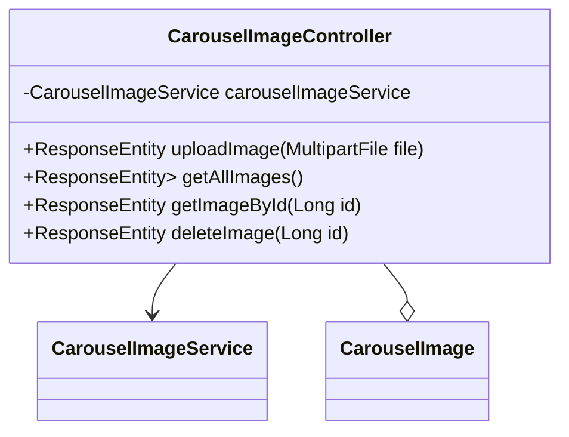

## 模块设计

### 模块内设计类的交互模型

本模块主要负责处理轮播图的上传、查询和删除功能。它提供 API 接口供前端调用，实现轮播图片的管理。控制器层调用服务层进行具体的业务逻辑处理，包括文件存储和数据库操作。

```mermaid
graph TD
    User["用户"] -->|HTTP Request| CarouselImageController
    CarouselImageController -->|calls| CarouselImageService
    CarouselImageService -->|interacts with| CarouselImageMapper
    CarouselImageController -->|uses| CarouselImage (Pojo)
```

### 设计类说明

_基于模块内设计类的交互模型创建的模块设计类图_



<**类图详细说明模板（类或接口说明**>

|                      |                         |        |                                     |             |             |     |                        |
| -------------------- | ----------------------- | ------ | ----------------------------------- | ----------- | ----------- | --- | ---------------------- |
| 类名                 | CarouselImageController | 所属包 | edu.neu.oaas.controller             |             |             |     |                        |
| 继承                 | 无                      |        |                                     |             |             |     |                        |
| 实现                 | 无                      |        |                                     |             |             |     |                        |
| 属性                 |                         |        |                                     |             |             |     |                        |
| 名称                 | 类型                    | 默认值 |                                     |             | Pub/Prv/Pro |     |                        |
| carouselImageService | CarouselImageService    | 无     |                                     |             | Private     |     |                        |
| 方法                 |                         |        |                                     |             |             |     |                        |
| 名称                 | 参数                    |        | 返回值                              | 异常        |             |     | 描述                   |
| uploadImage          | MultipartFile file      |        | ResponseEntity<CarouselImage>       | IOException |             |     | 上传轮播图片。         |
| getAllImages         | 无                      |        | ResponseEntity<List<CarouselImage>> | 无          |             |     | 获取所有轮播图片列表。 |
| getImageById         | Long id                 |        | ResponseEntity<CarouselImage>       | 无          |             |     | 根据 ID 获取轮播图片。 |
| deleteImage          | Long id                 |        | ResponseEntity<Void>                | 无          |             |     | 根据 ID 删除轮播图片。 |
| 事件                 |                         |        |                                     |             |             |     |                        |
| 名称                 | 条件                    |        | 参数                                | 目的        |             |     |                        |
| 无                   |                         |        |                                     |             |             |     |                        |

</rewritten_file>
