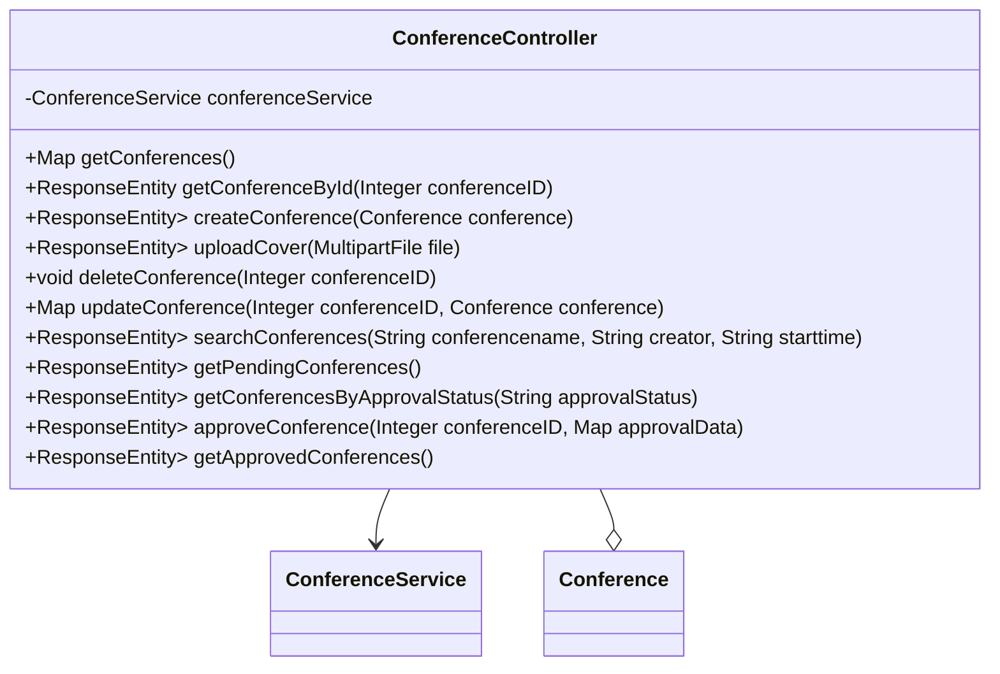

## 模块设计

### 模块内设计类的交互模型

本模块主要负责处理与会议管理相关的 HTTP 请求，包括获取所有会议、根据 ID 获取会议、创建会议、上传会议封面、删除会议、更新会议信息、搜索会议、获取待审批会议、根据审批状态获取会议以及审批会议等操作。它与服务层进行交互，实现具体的业务逻辑，例如文件存储和数据库操作。

```mermaid
graph TD
    User["用户"] -->|HTTP Request| ConferenceController
    ConferenceController -->|calls| ConferenceService
    ConferenceService -->|interacts with| ConferenceMapper
    ConferenceController -->|uses| Conference (Pojo)
```

### 设计类说明

_基于模块内设计类的交互模型创建的模块设计类图_



<**类图详细说明模板（类或接口说明**>

|                                |                                                         |        |                                     |           |             |     |                                          |
| ------------------------------ | ------------------------------------------------------- | ------ | ----------------------------------- | --------- | ----------- | --- | ---------------------------------------- |
| 类名                           | ConferenceController                                    | 所属包 | edu.neu.oaas.controller             |           |             |     |                                          |
| 继承                           | 无                                                      |        |                                     |           |             |     |                                          |
| 实现                           | 无                                                      |        |                                     |           |             |     |                                          |
| 属性                           |                                                         |        |                                     |           |             |     |                                          |
| 名称                           | 类型                                                    | 默认值 |                                     |           | Pub/Prv/Pro |     |                                          |
| conferenceService              | ConferenceService                                       | 无     |                                     |           | Private     |     |                                          |
| 方法                           |                                                         |        |                                     |           |             |     |                                          |
| 名称                           | 参数                                                    |        | 返回值                              | 异常      |             |     | 描述                                     |
| getConferences                 | 无                                                      |        | Map<String, Object>                 | 无        |             |     | 获取所有会议列表。                       |
| getConferenceById              | Integer conferenceID                                    |        | ResponseEntity<Conference>          | 无        |             |     | 根据会议 ID 获取会议详情。               |
| createConference               | Conference conference                                   |        | ResponseEntity<Map<String, String>> | Exception |             |     | 创建新的会议。                           |
| uploadCover                    | MultipartFile file                                      |        | ResponseEntity<Map<String, String>> | Exception |             |     | 上传会议封面图片。                       |
| deleteConference               | Integer conferenceID                                    |        | void                                | 无        |             |     | 根据会议 ID 删除会议。                   |
| updateConference               | Integer conferenceID, Conference conference             |        | Map<String, String>                 | 无        |             |     | 更新会议信息。                           |
| searchConferences              | String conferencename, String creator, String starttime |        | ResponseEntity<Map<String, Object>> | 无        |             |     | 根据会议名称、创建者和开始时间搜索会议。 |
| getPendingConferences          | 无                                                      |        | ResponseEntity<Map<String, Object>> | 无        |             |     | 获取所有待审批的会议列表。               |
| getConferencesByApprovalStatus | String approvalStatus                                   |        | ResponseEntity<Map<String, Object>> | 无        |             |     | 根据审批状态获取会议列表。               |
| approveConference              | Integer conferenceID, Map<String, String> approvalData  |        | ResponseEntity<Map<String, String>> | Exception |             |     | 审批会议（批准或拒绝）。                 |
| getApprovedConferences         | 无                                                      |        | ResponseEntity<Map<String, Object>> | 无        |             |     | 获取所有已审批的会议列表。               |
| 事件                           |                                                         |        |                                     |           |             |     |                                          |
| 名称                           | 条件                                                    |        | 参数                                | 目的      |             |     |                                          |
| 无                             |                                                         |        |                                     |           |             |     |                                          |

</rewritten_file>
