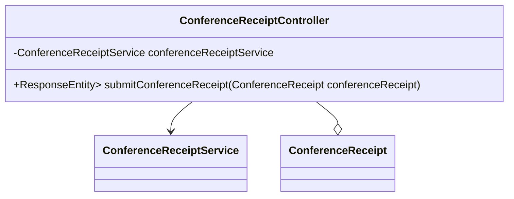

## 模块设计

### 模块内设计类的交互模型

本模块主要负责处理会议回执的提交功能。它提供 API 接口供前端调用，实现会议回执的创建。控制器层调用服务层进行具体的业务逻辑处理，包括将回执信息保存到数据库。

```mermaid
graph TD
    User["用户"] -->|HTTP Request| ConferenceReceiptController
    ConferenceReceiptController -->|calls| ConferenceReceiptService
    ConferenceReceiptService -->|interacts with| ConferenceReceiptMapper
    ConferenceReceiptController -->|uses| ConferenceReceipt (Pojo)
```

### 设计类说明

_基于模块内设计类的交互模型创建的模块设计类图_



<**类图详细说明模板（类或接口说明**>

|                          |                                     |        |                                     |           |             |     |                |
| ------------------------ | ----------------------------------- | ------ | ----------------------------------- | --------- | ----------- | --- | -------------- |
| 类名                     | ConferenceReceiptController         | 所属包 | edu.neu.oaas.controller             |           |             |     |                |
| 继承                     | 无                                  |        |                                     |           |             |     |                |
| 实现                     | 无                                  |        |                                     |           |             |     |                |
| 属性                     |                                     |        |                                     |           |             |     |                |
| 名称                     | 类型                                | 默认值 |                                     |           | Pub/Prv/Pro |     |                |
| conferenceReceiptService | ConferenceReceiptService            | 无     |                                     |           | Private     |     |                |
| 方法                     |                                     |        |                                     |           |             |     |                |
| 名称                     | 参数                                |        | 返回值                              | 异常      |             |     | 描述           |
| submitConferenceReceipt  | ConferenceReceipt conferenceReceipt |        | ResponseEntity<Map<String, String>> | Exception |             |     | 提交会议回执。 |
| 事件                     |                                     |        |                                     |           |             |     |                |
| 名称                     | 条件                                |        | 参数                                | 目的      |             |     |                |
| 无                       |                                     |        |                                     |           |             |     |                |

</rewritten_file>
