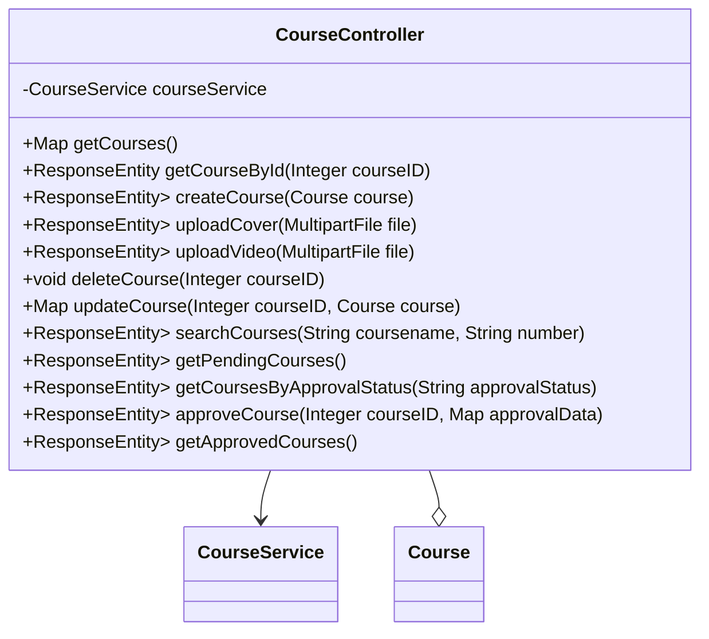

## 模块设计

### 模块内设计类的交互模型

本模块主要负责处理与课程管理相关的 HTTP 请求，包括获取所有课程、根据 ID 获取课程、创建课程、上传课程封面和视频、删除课程、更新课程信息、搜索课程、获取待审批课程、根据审批状态获取课程以及审批课程等操作。它与服务层进行交互，实现具体的业务逻辑，例如文件存储和数据库操作。

```mermaid
graph TD
    User["用户"] -->|HTTP Request| CourseController
    CourseController -->|calls| CourseService
    CourseService -->|interacts with| CourseMapper
    CourseController -->|uses| Course (Pojo)
```

### 设计类说明

_基于模块内设计类的交互模型创建的模块设计类图_



<**类图详细说明模板（类或接口说明**>

|                            |                                                    |        |                                     |           |             |     |                              |
| -------------------------- | -------------------------------------------------- | ------ | ----------------------------------- | --------- | ----------- | --- | ---------------------------- |
| 类名                       | CourseController                                   | 所属包 | edu.neu.oaas.controller             |           |             |     |                              |
| 继承                       | 无                                                 |        |                                     |           |             |     |                              |
| 实现                       | 无                                                 |        |                                     |           |             |     |                              |
| 属性                       |                                                    |        |                                     |           |             |     |                              |
| 名称                       | 类型                                               | 默认值 |                                     |           | Pub/Prv/Pro |     |                              |
| courseService              | CourseService                                      | 无     |                                     |           | Private     |     |                              |
| 方法                       |                                                    |        |                                     |           |             |     |                              |
| 名称                       | 参数                                               |        | 返回值                              | 异常      |             |     | 描述                         |
| getCourses                 | 无                                                 |        | Map<String, Object>                 | 无        |             |     | 获取所有课程列表。           |
| getCourseById              | Integer courseID                                   |        | ResponseEntity<Course>              | 无        |             |     | 根据课程 ID 获取课程详情。   |
| createCourse               | Course course                                      |        | ResponseEntity<Map<String, String>> | Exception |             |     | 创建新的课程。               |
| uploadCover                | MultipartFile file                                 |        | ResponseEntity<Map<String, String>> | Exception |             |     | 上传课程封面图片。           |
| uploadVideo                | MultipartFile file                                 |        | ResponseEntity<Map<String, String>> | Exception |             |     | 上传课程视频文件。           |
| deleteCourse               | Integer courseID                                   |        | void                                | 无        |             |     | 根据课程 ID 删除课程。       |
| updateCourse               | Integer courseID, Course course                    |        | Map<String, String>                 | 无        |             |     | 更新课程信息。               |
| searchCourses              | String coursename, String number                   |        | ResponseEntity<Map<String, Object>> | 无        |             |     | 根据课程名称和编号搜索课程。 |
| getPendingCourses          | 无                                                 |        | ResponseEntity<Map<String, Object>> | 无        |             |     | 获取所有待审批的课程列表。   |
| getCoursesByApprovalStatus | String approvalStatus                              |        | ResponseEntity<Map<String, Object>> | 无        |             |     | 根据审批状态获取课程列表。   |
| approveCourse              | Integer courseID, Map<String, String> approvalData |        | ResponseEntity<Map<String, String>> | Exception |             |     | 审批课程（批准或拒绝）。     |
| getApprovedCourses         | 无                                                 |        | ResponseEntity<Map<String, Object>> | 无        |             |     | 获取所有已审批的课程列表。   |
| 事件                       |                                                    |        |                                     |           |             |     |                              |
| 名称                       | 条件                                               |        | 参数                                | 目的      |             |     |                              |
| 无                         |                                                    |        |                                     |           |             |     |                              |
