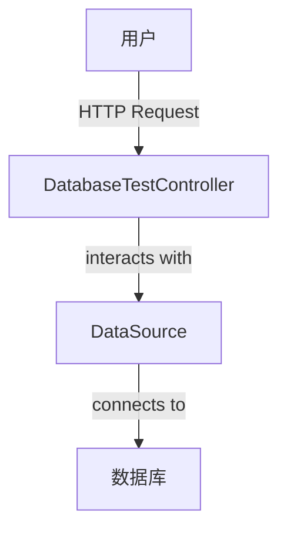
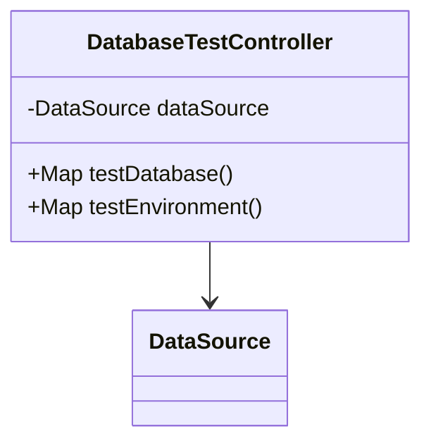

## 模块设计

### 模块内设计类的交互模型

本模块主要负责提供数据库连接和环境信息测试功能。它通过`DataSource`直接与数据库进行交互，执行简单的查询来验证连接状态和数据表记录数，同时还能获取当前 Java 运行环境和操作系统等信息，为系统健康检查提供支持。

### 设计类说明

_基于模块内设计类的交互模型创建的模块设计类图_

<**类图详细说明模板（类或接口说明**>

|                 |                        |        |                         |           |             |     |                                                                    |
| --------------- | ---------------------- | ------ | ----------------------- | --------- | ----------- | --- | ------------------------------------------------------------------ |
| 类名            | DatabaseTestController | 所属包 | edu.neu.oaas.controller |           |             |     |                                                                    |
| 继承            | 无                     |        |                         |           |             |     |                                                                    |
| 实现            | 无                     |        |                         |           |             |     |                                                                    |
| 属性            |                        |        |                         |           |             |     |                                                                    |
| 名称            | 类型                   | 默认值 |                         |           | Pub/Prv/Pro |     |                                                                    |
| dataSource      | DataSource             | 无     |                         |           | Private     |     |                                                                    |
| 方法            |                        |        |                         |           |             |     |                                                                    |
| 名称            | 参数                   |        | 返回值                  | 异常      |             |     | 描述                                                               |
| testDatabase    | 无                     |        | Map<String, Object>     | Exception |             |     | 测试数据库连接状态，并查询用户、课程、租户表的记录数。             |
| testEnvironment | 无                     |        | Map<String, Object>     | Exception |             |     | 获取并返回当前的系统环境信息，如 Java 版本、操作系统、内存使用等。 |
| 事件            |                        |        |                         |           |             |     |                                                                    |
| 名称            | 条件                   |        | 参数                    | 目的      |             |     |                                                                    |
| 无              |                        |        |                         |           |             |     |                                                                    |

</rewritten_file>
