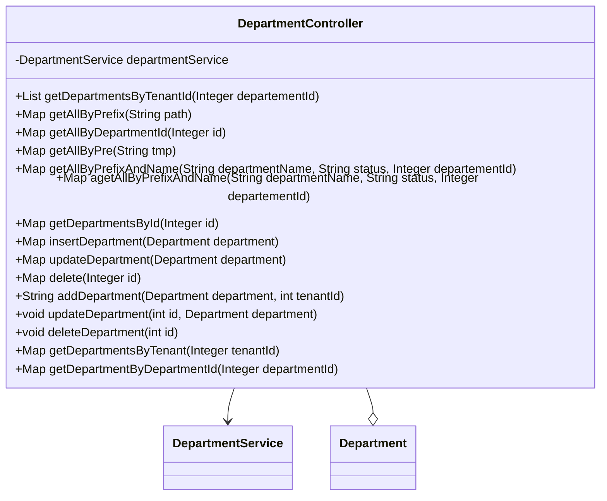

## 模块设计

### 模块内设计类的交互模型

本模块主要负责处理与部门相关的 HTTP 请求，包括根据租户 ID、部门 ID、部门名称和状态查询部门信息，以及部门的新增、更新和删除操作。它与服务层进行交互，以实现具体的业务逻辑。

```mermaid
graph TD
    User["用户"] -->|HTTP Request| DepartmentController
    DepartmentController -->|calls| DepartmentService
    DepartmentService -->|interacts with| DepartmentMapper
    DepartmentController -->|uses| Department (Pojo)
```

### 设计类说明

_基于模块内设计类的交互模型创建的模块设计类图_



<**类图详细说明模板（类或接口说明**>

|                             |                                                             |        |                         |           |             |     |                                                               |
| --------------------------- | ----------------------------------------------------------- | ------ | ----------------------- | --------- | ----------- | --- | ------------------------------------------------------------- |
| 类名                        | DepartmentController                                        | 所属包 | edu.neu.oaas.controller |           |             |     |                                                               |
| 继承                        | 无                                                          |        |                         |           |             |     |                                                               |
| 实现                        | 无                                                          |        |                         |           |             |     |                                                               |
| 属性                        |                                                             |        |                         |           |             |     |                                                               |
| 名称                        | 类型                                                        | 默认值 |                         |           | Pub/Prv/Pro |     |                                                               |
| departmentService           | DepartmentService                                           | 无     |                         |           | Private     |     |                                                               |
| 方法                        |                                                             |        |                         |           |             |     |                                                               |
| 名称                        | 参数                                                        |        | 返回值                  | 异常      |             |     | 描述                                                          |
| getDepartmentsByTenantId    | Integer departementId                                       |        | List<Department>        | 无        |             |     | 根据部门 ID 获取其下所有部门（通过路径前缀）。                |
| getAllByPrefix              | String path                                                 |        | Map                     | 无        |             |     | 根据路径前缀获取所有部门。                                    |
| getAllByDepartmentId        | Integer id                                                  |        | Map                     | 无        |             |     | 根据部门 ID 获取其下所有部门（用于管理员）。                  |
| getAllByPre                 | String tmp                                                  |        | Map                     | 无        |             |     | 根据路径前缀获取所有部门（路径变量版本）。                    |
| getAllByPrefixAndName       | String departmentName, String status, Integer departementId |        | Map                     | 无        |             |     | 根据部门名称、状态和部门 ID（获取路径前缀）查询部门。         |
| agetAllByPrefixAndName      | String departmentName, String status, Integer departementId |        | Map                     | 无        |             |     | 与 `getAllByPrefixAndName` 功能类似，使用 `@RequestMapping`。 |
| getDepartmentsById          | Integer id                                                  |        | Map                     | 无        |             |     | 根据部门 ID 获取部门信息。                                    |
| insertDepartment            | Department department                                       |        | Map                     | 无        |             |     | 新增部门。                                                    |
| updateDepartment            | Department department                                       |        | Map                     | 无        |             |     | 更新部门信息。                                                |
| delete                      | Integer id                                                  |        | Map                     | 无        |             |     | 删除部门。                                                    |
| addDepartment               | Department department, int tenantId                         |        | String                  | 无        |             |     | 新增部门（指定租户 ID）。                                     |
| updateDepartment            | int id, Department department                               |        | void                    | 无        |             |     | 更新部门信息（通过路径变量 ID）。                             |
| deleteDepartment            | int id                                                      |        | void                    | 无        |             |     | 删除部门（通过路径变量 ID）。                                 |
| getDepartmentsByTenant      | Integer tenantId                                            |        | Map                     | Exception |             |     | 根据租户 ID 获取部门列表。                                    |
| getDepartmentByDepartmentId | Integer departmentId                                        |        | Map                     | Exception |             |     | 根据部门 ID 获取部门信息。                                    |
| 事件                        |                                                             |        |                         |           |             |     |                                                               |
| 名称                        | 条件                                                        |        | 参数                    | 目的      |             |     |                                                               |
| 无                          |                                                             |        |                         |           |             |     |                                                               |

</rewritten_file>
