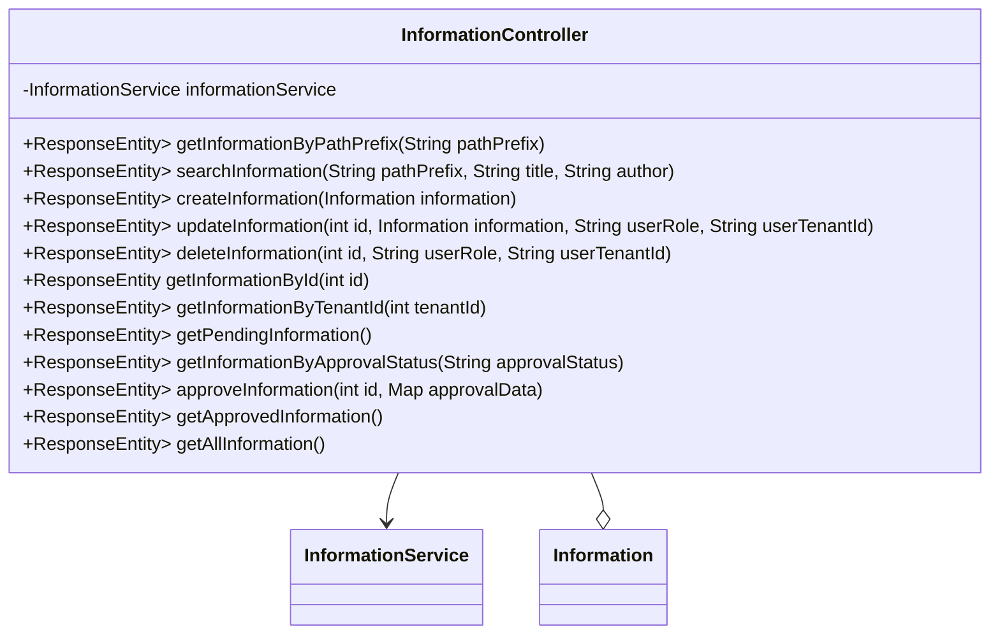

## 模块设计

### 模块内设计类的交互模型

本模块主要负责处理与系统资讯相关的 HTTP 请求，包括根据路径前缀、标题和作者查询资讯，以及资讯的创建、更新、删除、按 ID 获取、按租户 ID 获取、获取待审批资讯、按审批状态获取、审批资讯和获取已审批资讯等操作。它与服务层进行交互，以实现具体的业务逻辑，并包含权限验证逻辑（针对租户管理员）。

```mermaid
graph TD
    User["用户"] -->|HTTP Request| InformationController
    InformationController -->|calls| InformationService
    InformationService -->|interacts with| InformationMapper
    InformationController -->|uses| Information (Pojo)
```

### 设计类说明

_基于模块内设计类的交互模型创建的模块设计类图_



<**类图详细说明模板（类或接口说明**>

|                                |                                                                       |        |                                     |           |             |     |                                              |
| ------------------------------ | --------------------------------------------------------------------- | ------ | ----------------------------------- | --------- | ----------- | --- | -------------------------------------------- |
| 类名                           | InformationController                                                 | 所属包 | edu.neu.oaas.controller             |           |             |     |                                              |
| 继承                           | 无                                                                    |        |                                     |           |             |     |                                              |
| 实现                           | 无                                                                    |        |                                     |           |             |     |                                              |
| 属性                           |                                                                       |        |                                     |           |             |     |                                              |
| 名称                           | 类型                                                                  | 默认值 |                                     |           | Pub/Prv/Pro |     |                                              |
| informationService             | InformationService                                                    | 无     |                                     |           | Private     |     |                                              |
| 方法                           |                                                                       |        |                                     |           |             |     |                                              |
| 名称                           | 参数                                                                  |        | 返回值                              | 异常      |             |     | 描述                                         |
| getInformationByPathPrefix     | String pathPrefix                                                     |        | ResponseEntity<Map<String, Object>> | 无        |             |     | 根据路径前缀获取资讯列表。                   |
| searchInformation              | String pathPrefix, String title, String author                        |        | ResponseEntity<Map<String, Object>> | 无        |             |     | 根据标题和作者搜索资讯，并根据路径前缀过滤。 |
| createInformation              | Information information                                               |        | ResponseEntity<Map<String, String>> | Exception |             |     | 创建新的资讯。                               |
| updateInformation              | int id, Information information, String userRole, String userTenantId |        | ResponseEntity<Map<String, String>> | Exception |             |     | 更新资讯信息。包含租户管理员的权限验证。     |
| deleteInformation              | int id, String userRole, String userTenantId                          |        | ResponseEntity<Map<String, String>> | Exception |             |     | 删除资讯。包含租户管理员的权限验证。         |
| getInformationById             | int id                                                                |        | ResponseEntity<Information>         | 无        |             |     | 根据 ID 获取资讯详情。                       |
| getInformationByTenantId       | int tenantId                                                          |        | ResponseEntity<Map<String, Object>> | 无        |             |     | 根据租户 ID 获取资讯列表。                   |
| getPendingInformation          | 无                                                                    |        | ResponseEntity<Map<String, Object>> | 无        |             |     | 获取所有待审批的资讯列表。                   |
| getInformationByApprovalStatus | String approvalStatus                                                 |        | ResponseEntity<Map<String, Object>> | 无        |             |     | 根据审批状态获取资讯列表。                   |
| approveInformation             | int id, Map<String, String> approvalData                              |        | ResponseEntity<Map<String, String>> | Exception |             |     | 审批资讯（批准或拒绝）。                     |
| getApprovedInformation         | 无                                                                    |        | ResponseEntity<Map<String, Object>> | 无        |             |     | 获取所有已审批的资讯列表。                   |
| getAllInformation              | 无                                                                    |        | ResponseEntity<Map<String, Object>> | Exception |             |     | 获取所有资讯的接口。                         |
| 事件                           |                                                                       |        |                                     |           |             |     |                                              |
| 名称                           | 条件                                                                  |        | 参数                                | 目的      |             |     |                                              |
| 无                             |                                                                       |        |                                     |           |             |     |                                              |

</rewritten_file>
