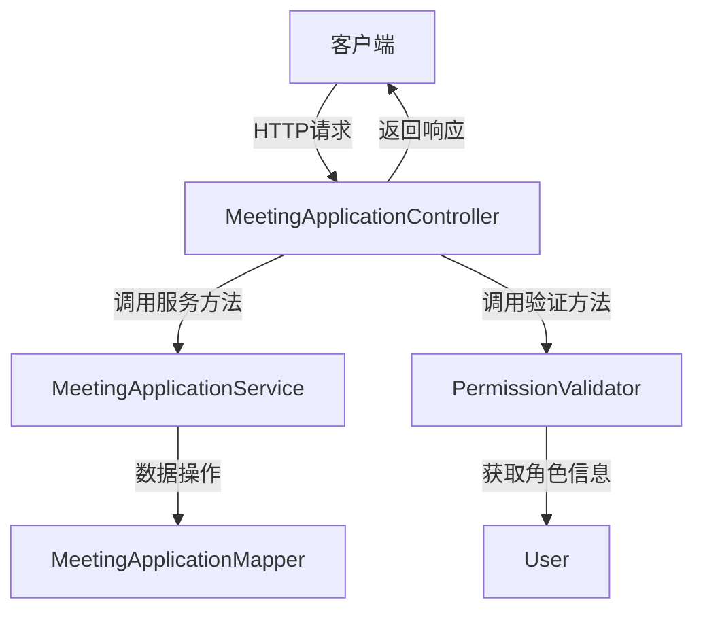
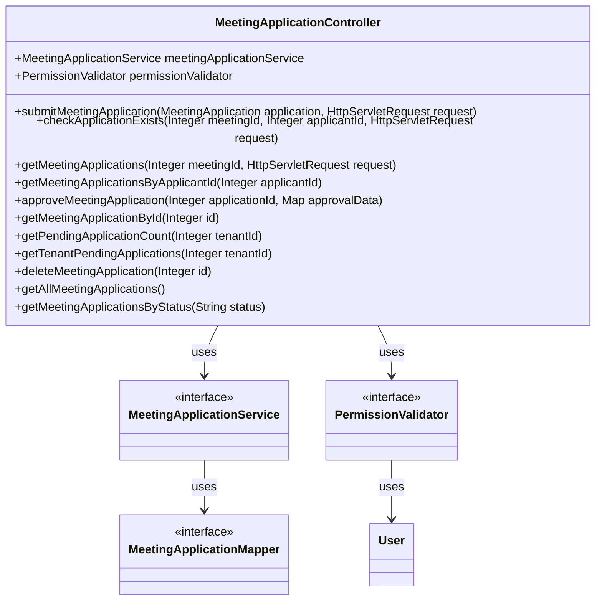

# MeetingApplicationController 模块设计

## 1. 模块设计

MeetingApplicationController 模块负责处理与会议申请相关的 HTTP 请求，包括提交申请、检查申请状态、获取特定会议或申请人的申请列表、审批申请以及删除申请等。它作为系统的前端接口，与客户端进行数据交互，并协调业务逻辑层（MeetingApplicationService）和权限验证层（PermissionValidator）来完成各项功能。

## 2. 模块内设计类的交互模型

## 3. 设计类说明

### MeetingApplicationController

| 属性/方法名                                               | 类型/返回类型                       | 说明                                   |
| --------------------------------------------------------- | ----------------------------------- | -------------------------------------- |
| `meetingApplicationService`                               | MeetingApplicationService           | 注入的会议申请服务，处理业务逻辑。     |
| `permissionValidator`                                     | PermissionValidator                 | 注入的权限验证器，用于验证用户权限。   |
| `submitMeetingApplication(application, request)`          | ResponseEntity<Map<String, Object>> | 提交新的会议申请。                     |
| `checkApplicationExists(meetingId, applicantId, request)` | ResponseEntity<Map<String, Object>> | 检查用户是否已申请过某个会议。         |
| `getMeetingApplications(meetingId, request)`              | ResponseEntity<Map<String, Object>> | 获取某个会议的所有申请，仅管理员可见。 |
| `getMeetingApplicationsByApplicantId(applicantId)`        | ResponseEntity<Map<String, Object>> | 根据申请人 ID 获取申请列表。           |
| `approveMeetingApplication(applicationId, approvalData)`  | ResponseEntity<Map<String, Object>> | 审批会议申请（批准或拒绝）。           |
| `getMeetingApplicationById(id)`                           | ResponseEntity<Map<String, Object>> | 根据 ID 获取会议申请详情。             |
| `getPendingApplicationCount(tenantId)`                    | ResponseEntity<Map<String, Object>> | 获取待审批的申请数量。                 |
| `getTenantPendingApplications(tenantId)`                  | ResponseEntity<Map<String, Object>> | 获取租户下所有待审批的申请。           |
| `deleteMeetingApplication(id)`                            | ResponseEntity<Map<String, Object>> | 删除指定 ID 的会议申请。               |
| `getAllMeetingApplications()`                             | ResponseEntity<Map<String, Object>> | 获取所有会议申请。                     |
| `getMeetingApplicationsByStatus(status)`                  | ResponseEntity<Map<String, Object>> | 根据状态获取会议申请。                 |

