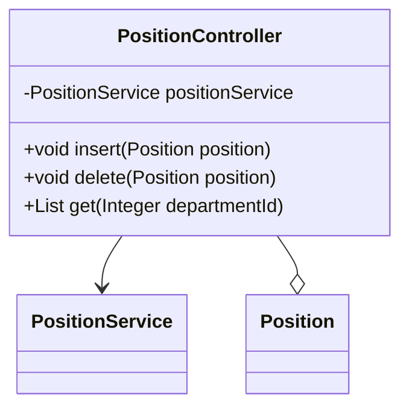

## 模块设计

### 模块内设计类的交互模型

本模块主要负责处理与职位信息相关的 HTTP 请求，包括职位的插入、删除和查询。它通过`PositionService`与服务层进行交互，实现具体的业务逻辑，例如数据库操作。

```mermaid
graph TD
    User["用户"] -->|HTTP Request| PositionController
    PositionController -->|calls| PositionService
    PositionService -->|interacts with| PositionMapper
    PositionController -->|uses| Position (Pojo)
```

### 设计类说明

_基于模块内设计类的交互模型创建的模块设计类图_



<**类图详细说明模板（类或接口说明**>

|                 |                      |        |                         |      |             |     |                            |
| --------------- | -------------------- | ------ | ----------------------- | ---- | ----------- | --- | -------------------------- |
| 类名            | PositionController   | 所属包 | edu.neu.oaas.controller |      |             |     |                            |
| 继承            | 无                   |        |                         |      |             |     |                            |
| 实现            | 无                   |        |                         |      |             |     |                            |
| 属性            |                      |        |                         |      |             |     |                            |
| 名称            | 类型                 | 默认值 |                         |      | Pub/Prv/Pro |     |                            |
| positionService | PositionService      | 无     |                         |      | Private     |     |                            |
| 方法            |                      |        |                         |      |             |     |                            |
| 名称            | 参数                 |        | 返回值                  | 异常 |             |     | 描述                       |
| insert          | Position position    |        | void                    | 无   |             |     | 插入新的职位信息。         |
| delete          | Position position    |        | void                    | 无   |             |     | 删除职位信息。             |
| get             | Integer departmentId |        | List<Position>          | 无   |             |     | 根据部门 ID 获取职位列表。 |
| 事件            |                      |        |                         |      |             |     |                            |
| 名称            | 条件                 |        | 参数                    | 目的 |             |     |                            |
| 无              |                      |        |                         |      |             |     |                            |

</rewritten_file>
