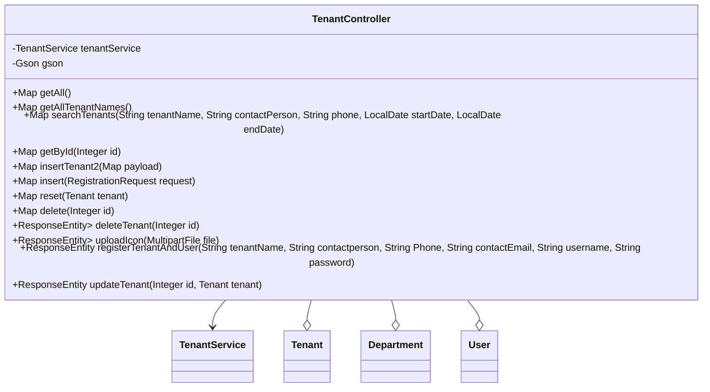

## 模块设计

### 模块内设计类的交互模型

本模块主要负责处理与租户管理相关的 HTTP 请求，包括获取所有租户、根据名称、联系人、电话和日期范围搜索租户、根据 ID 获取租户、新增租户（包括带部门和用户的注册）、更新租户信息、删除租户，以及上传租户图标等功能。它通过`TenantService`与服务层进行交互，实现具体的业务逻辑，并处理日期格式转换等辅助操作。

```mermaid
graph TD
    User["用户"] -->|HTTP Request| TenantController
    TenantController -->|calls| TenantService
    TenantService -->|interacts with| TenantMapper
    TenantController -->|uses| Tenant (Pojo)
    TenantController -->|uses| Department (Pojo)
    TenantController -->|uses| User (Pojo)
```

### 设计类说明

_基于模块内设计类的交互模型创建的模块设计类图_



<**类图详细说明模板（类或接口说明**>

|                       |                                                                                                              |            |                                     |                          |             |     |                                            |
| --------------------- | ------------------------------------------------------------------------------------------------------------ | ---------- | ----------------------------------- | ------------------------ | ----------- | --- | ------------------------------------------ |
| 类名                  | TenantController                                                                                             | 所属包     | edu.neu.oaas.controller             |                          |             |     |                                            |
| 继承                  | 无                                                                                                           |            |                                     |                          |             |     |                                            |
| 实现                  | 无                                                                                                           |            |                                     |                          |             |     |                                            |
| 属性                  |                                                                                                              |            |                                     |                          |             |     |                                            |
| 名称                  | 类型                                                                                                         | 默认值     |                                     |                          | Pub/Prv/Pro |     |                                            |
| tenantService         | TenantService                                                                                                | 无         |                                     |                          | Private     |     |                                            |
| gson                  | Gson                                                                                                         | 初始化实例 |                                     |                          | Private     |     |                                            |
| 方法                  |                                                                                                              |            |                                     |                          |             |     |                                            |
| 名称                  | 参数                                                                                                         |            | 返回值                              | 异常                     |             |     | 描述                                       |
| getAll                | 无                                                                                                           |            | Map                                 | 无                       |             |     | 获取所有租户列表。                         |
| getAllTenantNames     | 无                                                                                                           |            | Map<String, Object>                 | 无                       |             |     | 获取所有租户的名称列表。                   |
| searchTenants         | String tenantName, String contactPerson, String phone, LocalDate startDate, LocalDate endDate                |            | Map<String, Object>                 | 无                       |             |     | 根据条件搜索租户。                         |
| getById               | Integer id                                                                                                   |            | Map                                 | 无                       |             |     | 根据 ID 获取租户详情。                     |
| insertTenant2         | Map<String, Object> payload                                                                                  |            | Map<String, Object>                 | Exception                |             |     | 新增租户（第二种方式，不包含部门和用户）。 |
| insert                | RegistrationRequest request                                                                                  |            | Map<String, Object>                 | 无                       |             |     | 新增租户，同时注册部门和用户。             |
| reset                 | Tenant tenant                                                                                                |            | Map                                 | 无                       |             |     | 重置租户信息（实际是更新租户）。           |
| delete                | Integer id                                                                                                   |            | Map                                 | 无                       |             |     | 根据 ID 删除租户（旧接口）。               |
| deleteTenant          | Integer id                                                                                                   |            | ResponseEntity<Map<String, Object>> | Exception                |             |     | 根据 ID 删除租户（新接口）。               |
| uploadIcon            | MultipartFile file                                                                                           |            | ResponseEntity<Map<String, String>> | Exception                |             |     | 上传租户图标。                             |
| registerTenantAndUser | String tenantName, String contactperson, String Phone, String contactEmail, String username, String password |            | ResponseEntity<String>              | IllegalArgumentException |             |     | 注册租户和用户。                           |
| updateTenant          | Integer id, Tenant tenant                                                                                    |            | ResponseEntity<String>              | Exception                |             |     | 根据 ID 更新租户信息（新接口）。           |
| 事件                  |                                                                                                              |            |                                     |                          |             |     |                                            |
| 名称                  | 条件                                                                                                         |            | 参数                                | 目的                     |             |     |                                            |
| 无                    |                                                                                                              |            |                                     |                          |             |     |                                            |

</rewritten_file>
