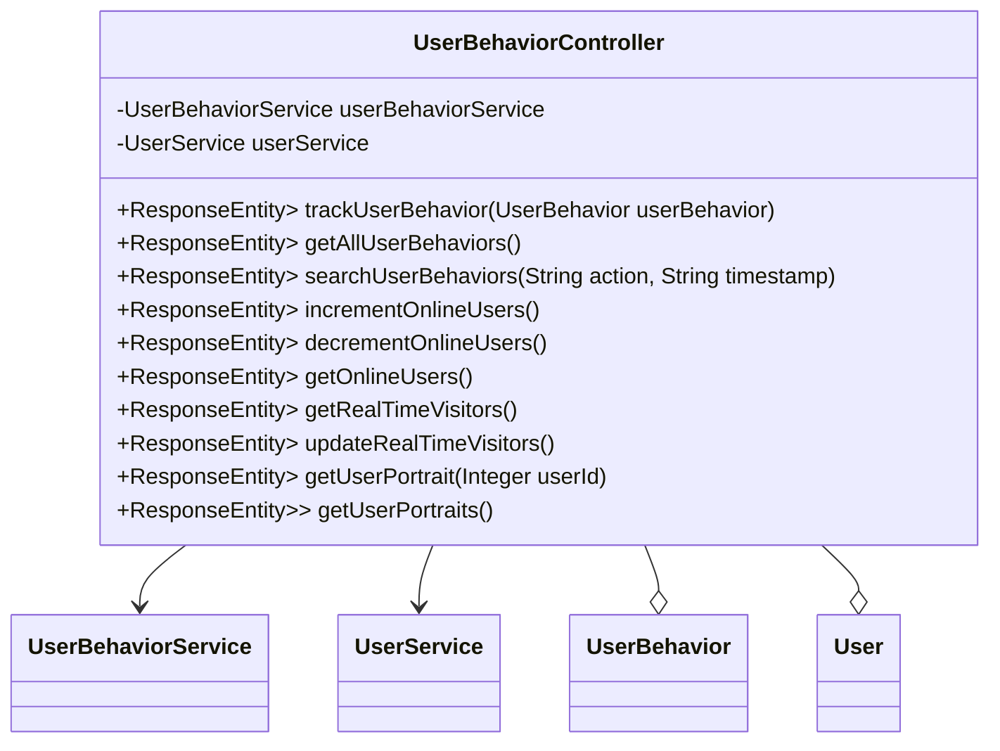

## 模块设计

### 模块内设计类的交互模型

本模块主要负责处理与用户行为相关的 HTTP 请求，包括记录用户行为、获取所有用户行为、搜索特定行为、管理在线用户计数（增加/减少）、获取实时访客数量，以及生成单个或所有用户的画像。它通过`UserBehaviorService`和`UserService`与服务层进行交互，实现具体的业务逻辑。

```mermaid
graph TD
    User["用户"] -->|HTTP Request| UserBehaviorController
    UserBehaviorController -->|calls| UserBehaviorService
    UserBehaviorController -->|calls| UserService
    UserBehaviorService -->|interacts with| UserBehaviorMapper
    UserService -->|interacts with| UserMapper
    UserBehaviorController -->|uses| UserBehavior (Pojo)
    UserBehaviorController -->|uses| User (Pojo)
```

### 设计类说明

_基于模块内设计类的交互模型创建的模块设计类图_



<**类图详细说明模板（类或接口说明**>

|                        |                                 |        |                                           |           |             |     |                                        |
| ---------------------- | ------------------------------- | ------ | ----------------------------------------- | --------- | ----------- | --- | -------------------------------------- |
| 类名                   | UserBehaviorController          | 所属包 | edu.neu.oaas.controller                   |           |             |     |                                        |
| 继承                   | 无                              |        |                                           |           |             |     |                                        |
| 实现                   | 无                              |        |                                           |           |             |     |                                        |
| 属性                   |                                 |        |                                           |           |             |     |                                        |
| 名称                   | 类型                            | 默认值 |                                           |           | Pub/Prv/Pro |     |                                        |
| userBehaviorService    | UserBehaviorService             | 无     |                                           |           | Private     |     |                                        |
| userService            | UserService                     | 无     |                                           |           | Private     |     |                                        |
| 方法                   |                                 |        |                                           |           |             |     |                                        |
| 名称                   | 参数                            |        | 返回值                                    | 异常      |             |     | 描述                                   |
| trackUserBehavior      | UserBehavior userBehavior       |        | ResponseEntity<Map<String, Object>>       | Exception |             |     | 记录用户行为。                         |
| getAllUserBehaviors    | 无                              |        | ResponseEntity<Map<String, Object>>       | Exception |             |     | 获取所有用户行为数据。                 |
| searchUserBehaviors    | String action, String timestamp |        | ResponseEntity<Map<String, Object>>       | Exception |             |     | 根据行为类型和时间戳搜索用户行为数据。 |
| incrementOnlineUsers   | 无                              |        | ResponseEntity<Map<String, Object>>       | 无        |             |     | 增加在线用户计数。                     |
| decrementOnlineUsers   | 无                              |        | ResponseEntity<Map<String, Object>>       | 无        |             |     | 减少在线用户计数。                     |
| getOnlineUsers         | 无                              |        | ResponseEntity<Map<String, Object>>       | 无        |             |     | 获取当前在线用户数量。                 |
| getRealTimeVisitors    | 无                              |        | ResponseEntity<Map<String, Object>>       | 无        |             |     | 获取实时访客数量。                     |
| updateRealTimeVisitors | 无                              |        | ResponseEntity<Map<String, Object>>       | 无        |             |     | 更新实时访客数。                       |
| getUserPortrait        | Integer userId                  |        | ResponseEntity<Map<String, Object>>       | Exception |             |     | 根据用户 ID 生成并获取用户画像。       |
| getUserPortraits       | 无                              |        | ResponseEntity<List<Map<String, Object>>> | Exception |             |     | 生成并获取所有用户的画像。             |
| 事件                   |                                 |        |                                           |           |             |     |                                        |
| 名称                   | 条件                            |        | 参数                                      | 目的      |             |     |                                        |
| 无                     |                                 |        |                                           |           |             |     |                                        |

</rewritten_file>
