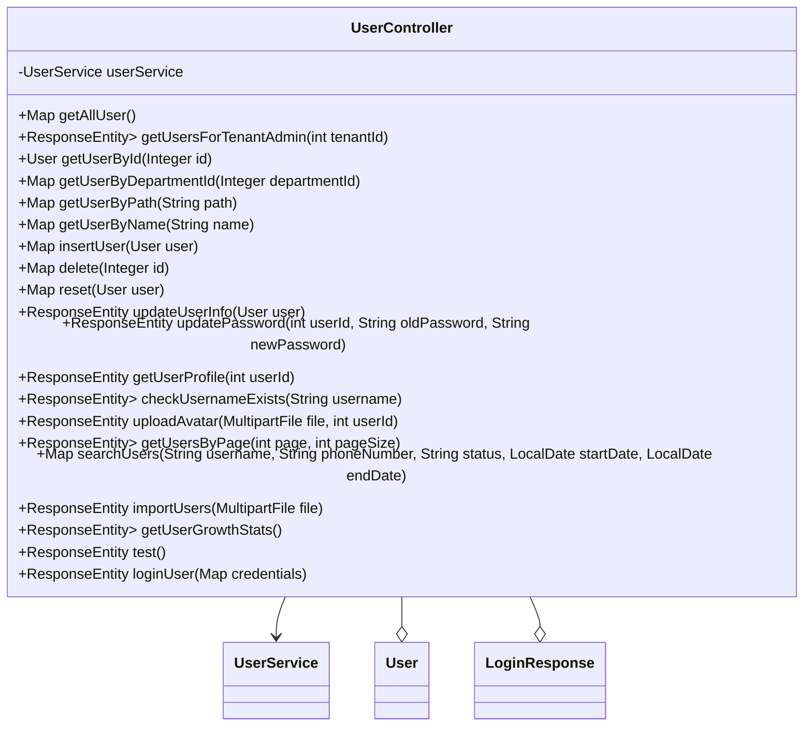

## 模块设计

### 模块内设计类的交互模型

本模块主要负责处理与用户管理相关的 HTTP 请求，包括获取所有用户、根据租户 ID 获取用户、根据 ID 获取用户、根据部门 ID 获取用户、根据路径获取用户、根据名称获取用户、插入用户、删除用户、重置密码、更新用户信息、更新密码、获取用户资料、检查用户名是否存在、上传头像、分页获取用户、搜索用户、导入用户和获取用户增长统计。它通过`UserService`与服务层进行交互，实现具体的业务逻辑，并处理文件上传、日期格式转换等辅助操作。

```mermaid
graph TD
    UserClient["客户端"] -->|HTTP Request| UserController
    UserController -->|calls| UserService
    UserService -->|interacts with| UserMapper
    UserController -->|uses| User (Pojo)
    UserController -->|uses| LoginResponse (Pojo)
```

### 设计类说明

_基于模块内设计类的交互模型创建的模块设计类图_



<**类图详细说明模板（类或接口说明**>

|                        |                                                                                            |        |                                     |           |             |     |                                            |
| ---------------------- | ------------------------------------------------------------------------------------------ | ------ | ----------------------------------- | --------- | ----------- | --- | ------------------------------------------ |
| 类名                   | UserController                                                                             | 所属包 | edu.neu.oaas.controller             |           |             |     |                                            |
| 继承                   | 无                                                                                         |        |                                     |           |             |     |                                            |
| 实现                   | 无                                                                                         |        |                                     |           |             |     |                                            |
| 属性                   |                                                                                            |        |                                     |           |             |     |                                            |
| 名称                   | 类型                                                                                       | 默认值 |                                     |           | Pub/Prv/Pro |     |                                            |
| userService            | UserService                                                                                | 无     |                                     |           | Private     |     |                                            |
| 方法                   |                                                                                            |        |                                     |           |             |     |                                            |
| 名称                   | 参数                                                                                       |        | 返回值                              | 异常      |             |     | 描述                                       |
| getAllUser             | 无                                                                                         |        | Map                                 | 无        |             |     | 获取所有用户信息（超级管理员）。           |
| getUsersForTenantAdmin | int tenantId                                                                               |        | ResponseEntity<Map<String, Object>> | 无        |             |     | 租户管理员获取其租户下的用户列表。         |
| getUserById            | Integer id                                                                                 |        | User                                | 无        |             |     | 根据 ID 获取用户。                         |
| getUserByDepartmentId  | Integer departmentId                                                                       |        | Map                                 | 无        |             |     | 根据部门 ID 获取用户列表。                 |
| getUserByPath          | String path                                                                                |        | Map                                 | 无        |             |     | 根据部门路径获取用户列表。                 |
| getUserByName          | String name                                                                                |        | Map                                 | 无        |             |     | 根据用户名获取用户。                       |
| insertUser             | User user                                                                                  |        | Map                                 | 无        |             |     | 插入新用户。                               |
| delete                 | Integer id                                                                                 |        | Map                                 | 无        |             |     | 根据 ID 删除用户。                         |
| reset                  | User user                                                                                  |        | Map                                 | 无        |             |     | 重置用户信息（实际为更新）。               |
| updateUserInfo         | User user                                                                                  |        | ResponseEntity<String>              | Exception |             |     | 更新用户个人信息。                         |
| updatePassword         | int userId, String oldPassword, String newPassword                                         |        | ResponseEntity<String>              | Exception |             |     | 更新用户密码。                             |
| getUserProfile         | int userId                                                                                 |        | ResponseEntity<User>                | Exception |             |     | 获取用户个人资料。                         |
| checkUsernameExists    | String username                                                                            |        | ResponseEntity<Map<String, Object>> | Exception |             |     | 检查用户名是否存在。                       |
| uploadAvatar           | MultipartFile file, int userId                                                             |        | ResponseEntity<String>              | Exception |             |     | 上传用户头像。                             |
| getUsersByPage         | int page, int pageSize                                                                     |        | ResponseEntity<Map<String, Object>> | Exception |             |     | 分页获取用户列表。                         |
| searchUsers            | String username, String phoneNumber, String status, LocalDate startDate, LocalDate endDate |        | Map                                 | 无        |             |     | 根据用户名、电话、状态和日期范围搜索用户。 |
| importUsers            | MultipartFile file                                                                         |        | ResponseEntity<String>              | Exception |             |     | 导入用户数据。                             |
| getUserGrowthStats     | 无                                                                                         |        | ResponseEntity<Map<String, Object>> | 无        |             |     | 获取用户增长统计数据。                     |
| test                   | 无                                                                                         |        | ResponseEntity<String>              | 无        |             |     | 测试控制器是否正常工作。                   |
| loginUser              | Map<String, String> credentials                                                            |        | ResponseEntity<LoginResponse>       | Exception |             |     | 用户登录验证。                             |
| 事件                   |                                                                                            |        |                                     |           |             |     |                                            |
| 名称                   | 条件                                                                                       |        | 参数                                | 目的      |             |     |                                            |
| 无                     |                                                                                            |        |                                     |           |             |     |                                            |

</rewritten_file>
