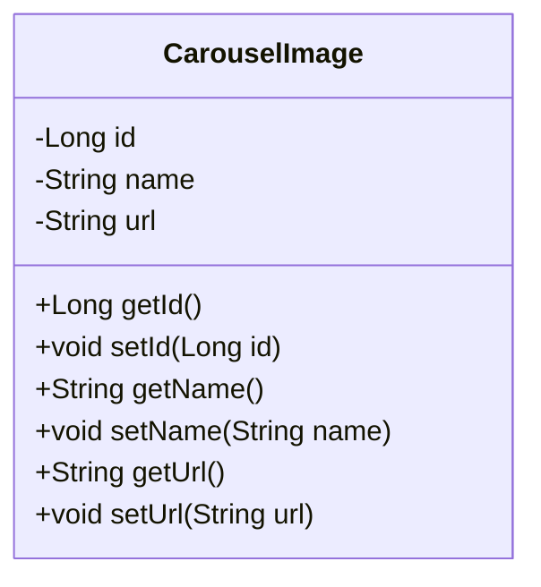

## Carousel Image Module Design

### 模块设计

`CarouselImage` 模块主要用于定义和管理系统中的轮播图信息。它作为数据传输对象 (DTO) 或实体类 (Entity) 使用，用于在系统的不同层之间传输轮播图相关的数据。该模块不包含业务逻辑，仅定义轮播图的结构和属性。

### 设计类说明

#### CarouselImage 类

`CarouselImage` 类是轮播图的数据模型，包含了轮播图的所有相关信息，例如图片 ID、名称和 URL。

| 属性名 | 类型   | 描述             |
| ------ | ------ | ---------------- |
| id     | Long   | 图片的唯一标识符 |
| name   | String | 图片名称         |
| url    | String | 图片的 URL 路径  |

