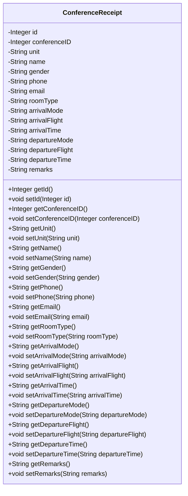

## 模块设计

### 模块设计概述

本模块定义了`ConferenceReceipt`数据传输对象（POJO），用于封装会议回执的各项属性，包括 ID、会议 ID、单位、姓名、性别、电话、电子邮件、房间类型、到达方式、到达航班、到达时间、离开方式、离开航班、离开时间以及备注。它作为数据载体，在应用的不同层之间传递会议回执相关信息。

### 设计类说明

_基于模块内设计类的交互模型创建的模块设计类图_

<**类图详细说明模板（类或接口说明**>

|                    |                        |        |                   |      |             |     |                |
| ------------------ | ---------------------- | ------ | ----------------- | ---- | ----------- | --- | -------------- |
| 类名               | ConferenceReceipt      | 所属包 | edu.neu.oaas.pojo |      |             |     |                |
| 继承               | 无                     |        |                   |      |             |     |                |
| 实现               | 无                     |        |                   |      |             |     |                |
| 属性               |                        |        |                   |      |             |     |                |
| 名称               | 类型                   | 默认值 |                   |      | Pub/Prv/Pro |     |                |
| id                 | Integer                | 无     |                   |      | Private     |     |                |
| conferenceID       | Integer                | 无     |                   |      | Private     |     |                |
| unit               | String                 | 无     |                   |      | Private     |     |                |
| name               | String                 | 无     |                   |      | Private     |     |                |
| gender             | String                 | 无     |                   |      | Private     |     |                |
| phone              | String                 | 无     |                   |      | Private     |     |                |
| email              | String                 | 无     |                   |      | Private     |     |                |
| roomType           | String                 | 无     |                   |      | Private     |     |                |
| arrivalMode        | String                 | 无     |                   |      | Private     |     |                |
| arrivalFlight      | String                 | 无     |                   |      | Private     |     |                |
| arrivalTime        | String                 | 无     |                   |      | Private     |     |                |
| departureMode      | String                 | 无     |                   |      | Private     |     |                |
| departureFlight    | String                 | 无     |                   |      | Private     |     |                |
| departureTime      | String                 | 无     |                   |      | Private     |     |                |
| remarks            | String                 | 无     |                   |      | Private     |     |                |
| 方法               |                        |        |                   |      |             |     |                |
| 名称               | 参数                   |        | 返回值            | 异常 |             |     | 描述           |
| getId              | 无                     |        | Integer           | 无   |             |     | 获取回执 ID。  |
| setId              | Integer id             |        | void              | 无   |             |     | 设置回执 ID。  |
| getConferenceID    | 无                     |        | Integer           | 无   |             |     | 获取会议 ID。  |
| setConferenceID    | Integer conferenceID   |        | void              | 无   |             |     | 设置会议 ID。  |
| getUnit            | 无                     |        | String            | 无   |             |     | 获取单位。     |
| setUnit            | String unit            |        | void              | 无   |             |     | 设置单位。     |
| getName            | 无                     |        | String            | 无   |             |     | 获取姓名。     |
| setName            | String name            |        | void              | 无   |             |     | 设置姓名。     |
| getGender          | 无                     |        | String            | 无   |             |     | 获取性别。     |
| setGender          | String gender          |        | void              | 无   |             |     | 设置性别。     |
| getPhone           | 无                     |        | String            | 无   |             |     | 获取电话。     |
| setPhone           | String phone           |        | void              | 无   |             |     | 设置电话。     |
| getEmail           | 无                     |        | String            | 无   |             |     | 获取电子邮件。 |
| setEmail           | String email           |        | void              | 无   |             |     | 设置电子邮件。 |
| getRoomType        | 无                     |        | String            | 无   |             |     | 获取房间类型。 |
| setRoomType        | String roomType        |        | void              | 无   |             |     | 设置房间类型。 |
| getArrivalMode     | 无                     |        | String            | 无   |             |     | 获取到达方式。 |
| setArrivalMode     | String arrivalMode     |        | void              | 无   |             |     | 设置到达方式。 |
| getArrivalFlight   | 无                     |        | String            | 无   |             |     | 获取到达航班。 |
| setArrivalFlight   | String arrivalFlight   |        | void              | 无   |             |     | 设置到达航班。 |
| getArrivalTime     | 无                     |        | String            | 无   |             |     | 获取到达时间。 |
| setArrivalTime     | String arrivalTime     |        | void              | 无   |             |     | 设置到达时间。 |
| getDepartureMode   | 无                     |        | String            | 无   |             |     | 获取离开方式。 |
| setDepartureMode   | String departureMode   |        | void              | 无   |             |     | 设置离开方式。 |
| getDepartureFlight | 无                     |        | String            | 无   |             |     | 获取离开航班。 |
| setDepartureFlight | String departureFlight |        | void              | 无   |             |     | 设置离开航班。 |
| getDepartureTime   | 无                     |        | String            | 无   |             |     | 获取离开时间。 |
| setDepartureTime   | String departureTime   |        | void              | 无   |             |     | 设置离开时间。 |
| getRemarks         | 无                     |        | String            | 无   |             |     | 获取备注。     |
| setRemarks         | String remarks         |        | void              | 无   |             |     | 设置备注。     |
| 事件               |                        |        |                   |      |             |     |                |
| 名称               | 条件                   |        | 参数              | 目的 |             |     |                |
| 无                 |                        |        |                   |      |             |     |                |

</rewritten_file>
