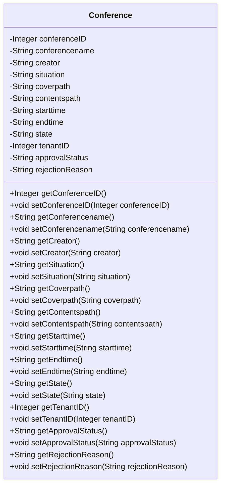

## Conference Module Design

### 模块设计

`Conference` 模块主要用于定义和管理系统中的会议信息。它作为数据传输对象 (DTO) 或实体类 (Entity) 使用，用于在系统的不同层之间传输会议相关的数据。该模块不包含业务逻辑，仅定义会议的结构和属性。

### 设计类说明

#### Conference 类

`Conference` 类是会议的数据模型，包含了会议的所有相关信息，例如会议 ID、会议名称、创建者、会议情况、封面路径、内容路径、开始时间、结束时间、状态、租户 ID、审批状态和拒绝原因。

| 属性名          | 类型    | 描述                                   |
| --------------- | ------- | -------------------------------------- |
| conferenceID    | Integer | 会议的唯一标识符                       |
| conferencename  | String  | 会议名称                               |
| creator         | String  | 创建者                                 |
| situation       | String  | 会议情况                               |
| coverpath       | String  | 封面图片路径                           |
| contentspath    | String  | 会议内容路径                           |
| starttime       | String  | 开始时间                               |
| endtime         | String  | 结束时间                               |
| state           | String  | 会议状态                               |
| tenantID        | Integer | 租户 ID                                |
| approvalStatus  | String  | 审批状态 (pending, approved, rejected) |
| rejectionReason | String  | 拒绝原因 (如果被拒绝)                  |

