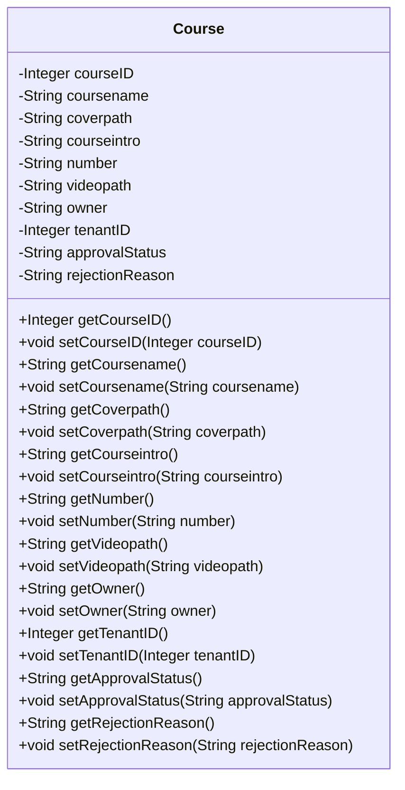

## 模块设计

### 模块设计概述

本模块定义了`Course`数据传输对象（POJO），用于封装课程的各项属性，包括课程 ID、课程名称、封面路径、课程简介、课程编号、视频路径、所有者、租户 ID、审批状态和拒绝原因。它作为数据载体，在应用的不同层之间传递课程相关信息。

### 设计类说明

_基于模块内设计类的交互模型创建的模块设计类图_

<**类图详细说明模板（类或接口说明**>

|                    |                        |           |                   |      |             |     |                |
| ------------------ | ---------------------- | --------- | ----------------- | ---- | ----------- | --- | -------------- |
| 类名               | Course                 | 所属包    | edu.neu.oaas.pojo |      |             |     |                |
| 继承               | 无                     |           |                   |      |             |     |                |
| 实现               | 无                     |           |                   |      |             |     |                |
| 属性               |                        |           |                   |      |             |     |                |
| 名称               | 类型                   | 默认值    |                   |      | Pub/Prv/Pro |     |                |
| courseID           | Integer                | 无        |                   |      | Private     |     |                |
| coursename         | String                 | 无        |                   |      | Private     |     |                |
| coverpath          | String                 | 无        |                   |      | Private     |     |                |
| courseintro        | String                 | 无        |                   |      | Private     |     |                |
| number             | String                 | 无        |                   |      | Private     |     |                |
| videopath          | String                 | 无        |                   |      | Private     |     |                |
| owner              | String                 | 无        |                   |      | Private     |     |                |
| tenantID           | Integer                | 无        |                   |      | Private     |     |                |
| approvalStatus     | String                 | "pending" |                   |      | Private     |     |                |
| rejectionReason    | String                 | 无        |                   |      | Private     |     |                |
| 方法               |                        |           |                   |      |             |     |                |
| 名称               | 参数                   |           | 返回值            | 异常 |             |     | 描述           |
| getCourseID        | 无                     |           | Integer           | 无   |             |     | 获取课程 ID。  |
| setCourseID        | Integer courseID       |           | void              | 无   |             |     | 设置课程 ID。  |
| getCoursename      | 无                     |           | String            | 无   |             |     | 获取课程名称。 |
| setCoursename      | String coursename      |           | void              | 无   |             |     | 设置课程名称。 |
| getCoverpath       | 无                     |           | String            | 无   |             |     | 获取封面路径。 |
| setCoverpath       | String coverpath       |           | void              | 无   |             |     | 设置封面路径。 |
| getCourseintro     | 无                     |           | String            | 无   |             |     | 获取课程简介。 |
| setCourseintro     | String courseintro     |           | void              | 无   |             |     | 设置课程简介。 |
| getNumber          | 无                     |           | String            | 无   |             |     | 获取课程编号。 |
| setNumber          | String number          |           | void              | 无   |             |     | 设置课程编号。 |
| getVideopath       | 无                     |           | String            | 无   |             |     | 获取视频路径。 |
| setVideopath       | String videopath       |           | void              | 无   |             |     | 设置视频路径。 |
| getOwner           | 无                     |           | String            | 无   |             |     | 获取所有者。   |
| setOwner           | String owner           |           | void              | 无   |             |     | 设置所有者。   |
| getTenantID        | 无                     |           | Integer           | 无   |             |     | 获取租户 ID。  |
| setTenantID        | Integer tenantID       |           | void              | 无   |             |     | 设置租户 ID。  |
| getApprovalStatus  | 无                     |           | String            | 无   |             |     | 获取审批状态。 |
| setApprovalStatus  | String approvalStatus  |           | void              | 无   |             |     | 设置审批状态。 |
| getRejectionReason | 无                     |           | String            | 无   |             |     | 获取拒绝原因。 |
| setRejectionReason | String rejectionReason |           | void              | 无   |             |     | 设置拒绝原因。 |
| 事件               |                        |           |                   |      |             |     |                |
| 名称               | 条件                   |           | 参数              | 目的 |             |     |                |
| 无                 |                        |           |                   |      |             |     |                |

</rewritten_file>
