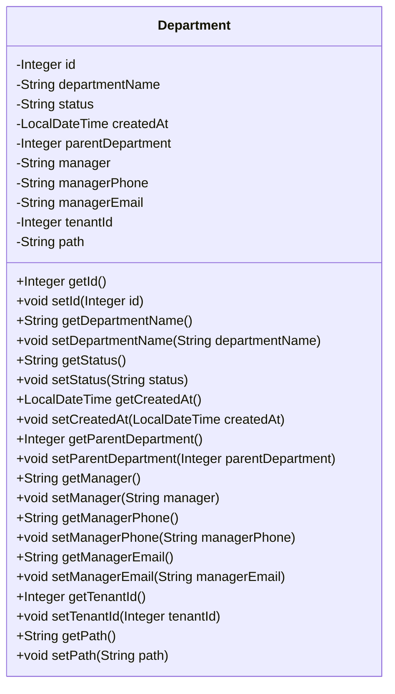

## Department Module Design

### 模块设计

`Department` 模块主要用于定义和管理系统中的部门信息。它作为数据传输对象 (DTO) 或实体类 (Entity) 使用，用于在系统的不同层之间传输部门相关的数据。该模块不包含业务逻辑，仅定义部门的结构和属性。

### 设计类说明

#### Department 类

`Department` 类是部门的数据模型，包含了部门的所有相关信息，例如部门 ID、部门名称、状态、创建时间、父部门 ID、负责人、负责人电话、负责人邮箱、租户 ID 和路径。

| 属性名           | 类型          | 描述             |
| ---------------- | ------------- | ---------------- |
| id               | Integer       | 部门的唯一标识符 |
| departmentName   | String        | 部门名称         |
| status           | String        | 部门状态         |
| createdAt        | LocalDateTime | 创建时间         |
| parentDepartment | Integer       | 父部门 ID        |
| manager          | String        | 负责人           |
| managerPhone     | String        | 负责人电话       |
| managerEmail     | String        | 负责人邮箱       |
| tenantId         | Integer       | 租户 ID          |
| path             | String        | 部门路径         |

