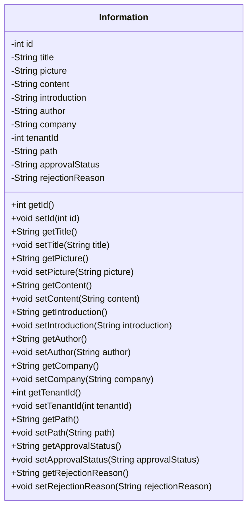

## 模块设计

### 模块设计概述

本模块定义了`Information`数据传输对象（POJO），用于封装资讯的各项属性，包括 ID、标题、图片路径、内容、简介、作者、公司、租户 ID、路径、审批状态和拒绝原因。它作为数据载体，在应用的不同层之间传递资讯相关信息。

### 设计类说明

_基于模块内设计类的交互模型创建的模块设计类图_

<**类图详细说明模板（类或接口说明**>

|                    |                        |           |                   |      |             |     |                |
| ------------------ | ---------------------- | --------- | ----------------- | ---- | ----------- | --- | -------------- |
| 类名               | Information            | 所属包    | edu.neu.oaas.pojo |      |             |     |                |
| 继承               | 无                     |           |                   |      |             |     |                |
| 实现               | 无                     |           |                   |      |             |     |                |
| 属性               |                        |           |                   |      |             |     |                |
| 名称               | 类型                   | 默认值    |                   |      | Pub/Prv/Pro |     |                |
| id                 | int                    | 无        |                   |      | Private     |     |                |
| title              | String                 | 无        |                   |      | Private     |     |                |
| picture            | String                 | 无        |                   |      | Private     |     |                |
| content            | String                 | 无        |                   |      | Private     |     |                |
| introduction       | String                 | 无        |                   |      | Private     |     |                |
| author             | String                 | 无        |                   |      | Private     |     |                |
| company            | String                 | 无        |                   |      | Private     |     |                |
| tenantId           | int                    | 无        |                   |      | Private     |     |                |
| path               | String                 | 无        |                   |      | Private     |     |                |
| approvalStatus     | String                 | "pending" |                   |      | Private     |     |                |
| rejectionReason    | String                 | 无        |                   |      | Private     |     |                |
| 方法               |                        |           |                   |      |             |     |                |
| 名称               | 参数                   |           | 返回值            | 异常 |             |     | 描述           |
| getId              | 无                     |           | int               | 无   |             |     | 获取资讯 ID。  |
| setId              | int id                 |           | void              | 无   |             |     | 设置资讯 ID。  |
| getTitle           | 无                     |           | String            | 无   |             |     | 获取标题。     |
| setTitle           | String title           |           | void              | 无   |             |     | 设置标题。     |
| getPicture         | 无                     |           | String            | 无   |             |     | 获取图片路径。 |
| setPicture         | String picture         |           | void              | 无   |             |     | 设置图片路径。 |
| getContent         | 无                     |           | String            | 无   |             |     | 获取内容。     |
| setContent         | String content         |           | void              | 无   |             |     | 设置内容。     |
| getIntroduction    | 无                     |           | String            | 无   |             |     | 获取简介。     |
| setIntroduction    | String introduction    |           | void              | 无   |             |     | 设置简介。     |
| getAuthor          | 无                     |           | String            | 无   |             |     | 获取作者。     |
| setAuthor          | String author          |           | void              | 无   |             |     | 设置作者。     |
| getCompany         | 无                     |           | String            | 无   |             |     | 获取公司。     |
| setCompany         | String company         |           | void              | 无   |             |     | 设置公司。     |
| getTenantId        | 无                     |           | int               | 无   |             |     | 获取租户 ID。  |
| setTenantId        | int tenantId           |           | void              | 无   |             |     | 设置租户 ID。  |
| getPath            | 无                     |           | String            | 无   |             |     | 获取路径。     |
| setPath            | String path            |           | void              | 无   |             |     | 设置路径。     |
| getApprovalStatus  | 无                     |           | String            | 无   |             |     | 获取审批状态。 |
| setApprovalStatus  | String approvalStatus  |           | void              | 无   |             |     | 设置审批状态。 |
| getRejectionReason | 无                     |           | String            | 无   |             |     | 获取拒绝原因。 |
| setRejectionReason | String rejectionReason |           | void              | 无   |             |     | 设置拒绝原因。 |
| 事件               |                        |           |                   |      |             |     |                |
| 名称               | 条件                   |           | 参数              | 目的 |             |     |                |
| 无                 |                        |           |                   |      |             |     |                |

</rewritten_file>
