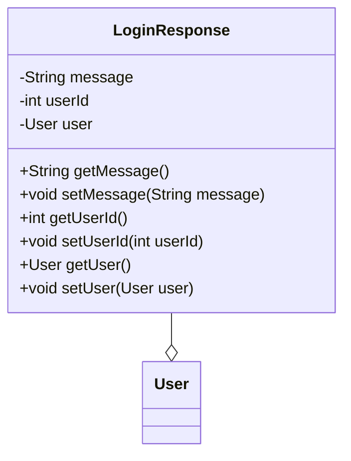

## 模块设计

### 模块设计概述

本模块定义了`LoginResponse`数据传输对象（POJO），用于封装用户登录响应的属性，包括登录消息、用户 ID 和用户信息。它作为数据载体，在用户登录成功后向前端传递相关信息。

### 设计类说明

_基于模块内设计类的交互模型创建的模块设计类图_

<**类图详细说明模板（类或接口说明**>

|            |                |        |                   |      |             |     |                |
| ---------- | -------------- | ------ | ----------------- | ---- | ----------- | --- | -------------- |
| 类名       | LoginResponse  | 所属包 | edu.neu.oaas.pojo |      |             |     |                |
| 继承       | 无             |        |                   |      |             |     |                |
| 实现       | 无             |        |                   |      |             |     |                |
| 属性       |                |        |                   |      |             |     |                |
| 名称       | 类型           | 默认值 |                   |      | Pub/Prv/Pro |     |                |
| message    | String         | 无     |                   |      | Private     |     |                |
| userId     | int            | 无     |                   |      | Private     |     |                |
| user       | User           | 无     |                   |      | Private     |     |                |
| 方法       |                |        |                   |      |             |     |                |
| 名称       | 参数           |        | 返回值            | 异常 |             |     | 描述           |
| getMessage | 无             |        | String            | 无   |             |     | 获取登录消息。 |
| setMessage | String message |        | void              | 无   |             |     | 设置登录消息。 |
| getUserId  | 无             |        | int               | 无   |             |     | 获取用户 ID。  |
| setUserId  | int userId     |        | void              | 无   |             |     | 设置用户 ID。  |
| getUser    | 无             |        | User              | 无   |             |     | 获取用户信息。 |
| setUser    | User user      |        | void              | 无   |             |     | 设置用户信息。 |
| 事件       |                |        |                   |      |             |     |                |
| 名称       | 条件           |        | 参数              | 目的 |             |     |                |
| 无         |                |        |                   |      |             |     |                |

</rewritten_file>
