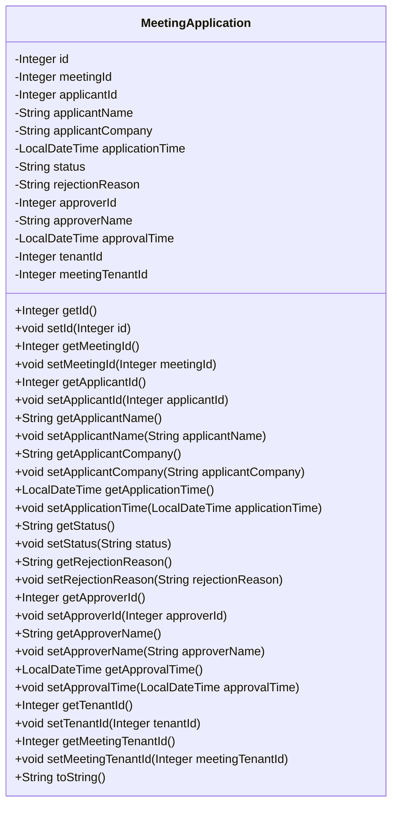

## Meeting Application Module Design

### 模块设计

`MeetingApplication` 模块主要负责管理会议申请的生命周期，包括申请的创建、审批和状态管理。它作为数据传输对象 (DTO) 或实体类 (Entity) 使用，用于在系统的不同层之间传输会议申请相关的数据。该模块不包含业务逻辑，仅定义会议申请的结构和属性。

### 设计类说明

#### MeetingApplication 类

`MeetingApplication` 类是会议申请的数据模型，包含了会议申请的所有相关信息，例如申请 ID、会议 ID、申请人信息、申请时间、审批状态、审批人信息等。

| 属性名           | 类型          | 描述                                   |
| ---------------- | ------------- | -------------------------------------- |
| id               | Integer       | 会议申请的唯一标识符                   |
| meetingId        | Integer       | 关联的会议 ID                          |
| applicantId      | Integer       | 申请人用户 ID                          |
| applicantName    | String        | 申请人姓名                             |
| applicantCompany | String        | 申请人公司名称                         |
| applicationTime  | LocalDateTime | 提交申请的时间                         |
| status           | String        | 申请状态 (pending, approved, rejected) |
| rejectionReason  | String        | 拒绝原因 (如果被拒绝)                  |
| approverId       | Integer       | 审批人用户 ID                          |
| approverName     | String        | 审批人姓名                             |
| approvalTime     | LocalDateTime | 审批时间                               |
| tenantId         | Integer       | 申请人所属租户 ID                      |
| meetingTenantId  | Integer       | 会议所属租户 ID                        |

