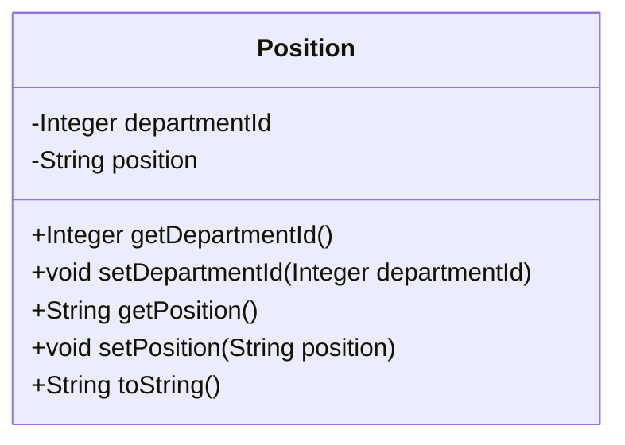

## Position Module Design

### 模块设计

`Position` 模块主要用于定义和管理系统中的职位信息。它作为数据传输对象 (DTO) 或实体类 (Entity) 使用，用于在系统的不同层之间传输职位相关的数据。该模块不包含业务逻辑，仅定义职位的结构和属性。

### 设计类说明

#### Position 类

`Position` 类是职位的数据模型，包含了职位的所有相关信息，例如所属部门 ID 和职位名称。

| 属性名       | 类型    | 描述        |
| ------------ | ------- | ----------- |
| departmentId | Integer | 所属部门 ID |
| position     | String  | 职位名称    |

