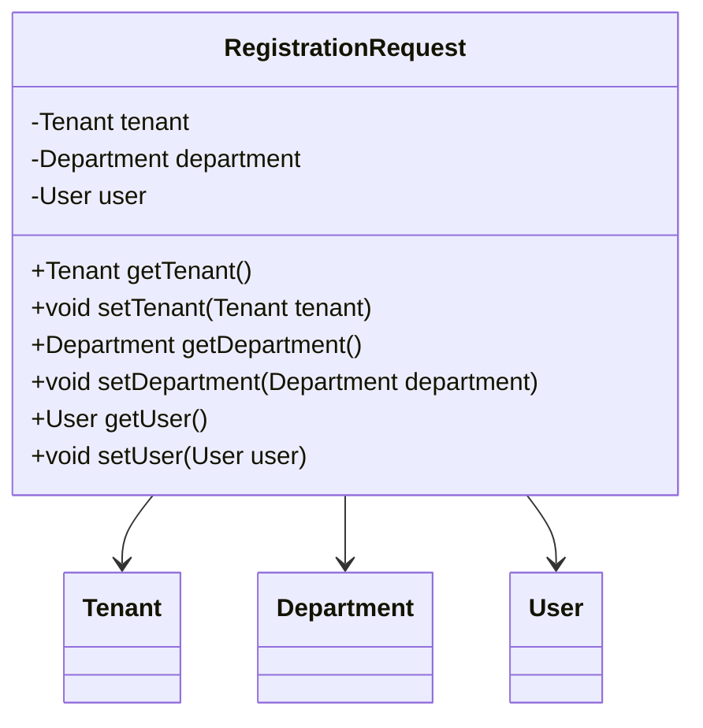

## Registration Request Module Design

### 模块设计

`RegistrationRequest` 模块主要用于封装用户注册时所需的所有相关信息，包括租户信息、部门信息和用户信息。它作为一个聚合对象，用于在注册过程中方便地传递多个相关实体的数据。该模块不包含业务逻辑，仅定义注册请求的结构和属性。

### 设计类说明

#### RegistrationRequest 类

`RegistrationRequest` 类是用户注册请求的数据模型，包含了注册时提交的租户、部门和用户的所有数据。

| 属性名     | 类型       | 描述     |
| ---------- | ---------- | -------- |
| tenant     | Tenant     | 租户信息 |
| department | Department | 部门信息 |
| user       | User       | 用户信息 |

