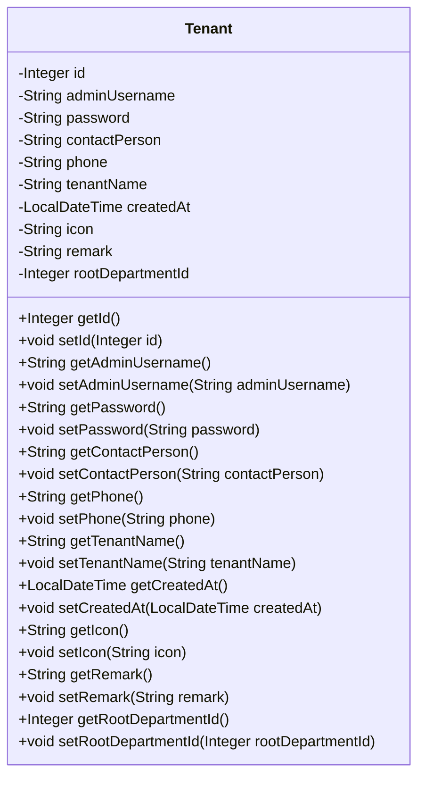

## Tenant Module Design

### 模块设计

`Tenant` 模块主要用于定义和管理系统中的租户信息。它作为数据传输对象 (DTO) 或实体类 (Entity) 使用，用于在系统的不同层之间传输租户相关的数据。该模块不包含业务逻辑，仅定义租户的结构和属性。

### 设计类说明

#### Tenant 类

`Tenant` 类是租户的数据模型，包含了租户的所有相关信息，例如租户 ID、管理员用户名、联系人、电话、租户名称、创建时间、图标、备注和根部门 ID。

| 属性名           | 类型          | 描述             |
| ---------------- | ------------- | ---------------- |
| id               | Integer       | 租户的唯一标识符 |
| adminUsername    | String        | 管理员用户名     |
| password         | String        | 管理员密码       |
| contactPerson    | String        | 联系人           |
| phone            | String        | 联系电话         |
| tenantName       | String        | 租户名称         |
| createdAt        | LocalDateTime | 创建时间         |
| icon             | String        | 租户图标         |
| remark           | String        | 备注             |
| rootDepartmentId | Integer       | 根部门 ID        |

