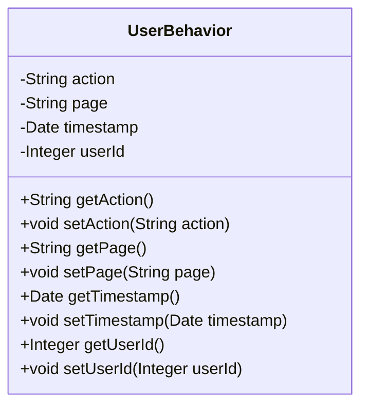

## User Behavior Module Design

### 模块设计

`UserBehavior` 模块主要用于记录和管理用户在系统中的行为数据。它作为数据传输对象 (DTO) 或实体类 (Entity) 使用，用于在系统的不同层之间传输用户行为相关的数据。该模块不包含业务逻辑，仅定义用户行为的结构和属性。

### 设计类说明

#### UserBehavior 类

`UserBehavior` 类是用户行为的数据模型，包含了用户的操作、所在页面、操作时间戳以及执行该行为的用户 ID。

| 属性名    | 类型    | 描述              |
| --------- | ------- | ----------------- |
| action    | String  | 用户执行的操作    |
| page      | String  | 用户所在页面      |
| timestamp | Date    | 操作发生的时间    |
| userId    | Integer | 执行操作的用户 ID |

