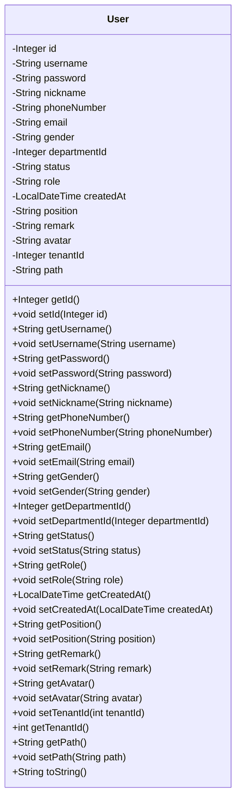

## User Module Design

### 模块设计

`User` 模块主要用于定义和管理系统中的用户信息。它作为数据传输对象 (DTO) 或实体类 (Entity) 使用，用于在系统的不同层之间传输用户相关的数据。该模块不包含业务逻辑，仅定义用户的结构和属性。

### 设计类说明

#### User 类

`User` 类是用户的数据模型，包含了用户的所有相关信息，例如用户 ID、用户名、密码、昵称、电话号码、电子邮件、性别、部门 ID、状态、角色、创建时间、职位、备注、头像和租户 ID。

| 属性名       | 类型          | 描述             |
| ------------ | ------------- | ---------------- |
| id           | Integer       | 用户的唯一标识符 |
| username     | String        | 用户名           |
| password     | String        | 密码             |
| nickname     | String        | 昵称             |
| phoneNumber  | String        | 电话号码         |
| email        | String        | 电子邮件         |
| gender       | String        | 性别             |
| departmentId | Integer       | 部门 ID          |
| status       | String        | 状态             |
| role         | String        | 角色             |
| createdAt    | LocalDateTime | 创建时间         |
| position     | String        | 职位             |
| remark       | String        | 备注             |
| avatar       | String        | 头像路径         |
| tenantId     | Integer       | 租户 ID          |
| path         | String        | 用户路径         |

