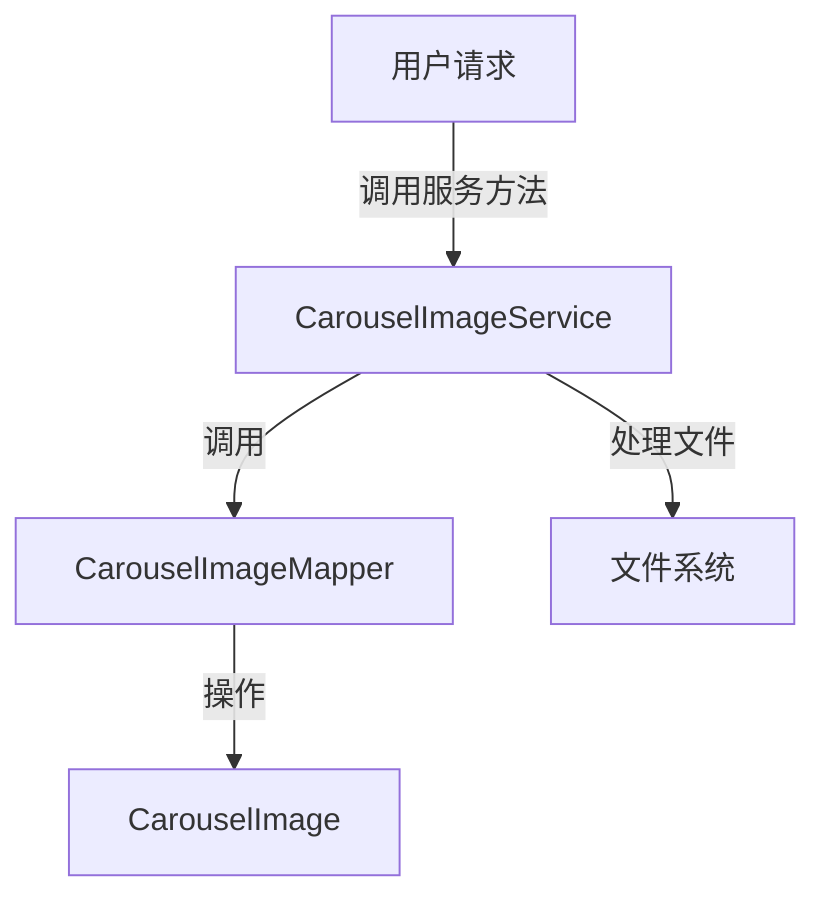

## Carousel Image Service Module Design

### 模块设计

`CarouselImageService` 模块负责处理轮播图的业务逻辑，包括图片的上传、保存、查询和删除。它作为业务逻辑层的一部分，协调前端请求与数据持久层 (`CarouselImageMapper`) 和文件系统之间的交互，确保轮播图数据的完整性和操作的正确性。

### 模块内设计类的交互模型

该模块主要与 `CarouselImageMapper` 和 `CarouselImage` POJO 进行交互。

### 设计类说明

#### CarouselImageService 类

`CarouselImageService` 类提供了对轮播图数据进行操作的业务方法。它通过依赖注入 `CarouselImageMapper` 来实现数据持久化，并通过文件 I/O 操作管理实际的图片文件。

| 属性名              | 类型                | 描述                     |
| ------------------- | ------------------- | ------------------------ |
| carouselImageMapper | CarouselImageMapper | 用于与数据库交互的映射器 |
| IMAGE_BASE_PATH     | String              | 图片文件存储的根路径     |

| 方法名       | 返回类型            | 描述                                     |
| ------------ | ------------------- | ---------------------------------------- |
| saveImage    | CarouselImage       | 保存上传的图片文件并将其信息记录到数据库 |
| getAllImages | List<CarouselImage> | 获取所有轮播图的列表                     |
| getImageById | CarouselImage       | 根据图片 ID 获取单个轮播图信息           |
| deleteImage  | void                | 根据图片 ID 删除数据库记录和物理文件     |

