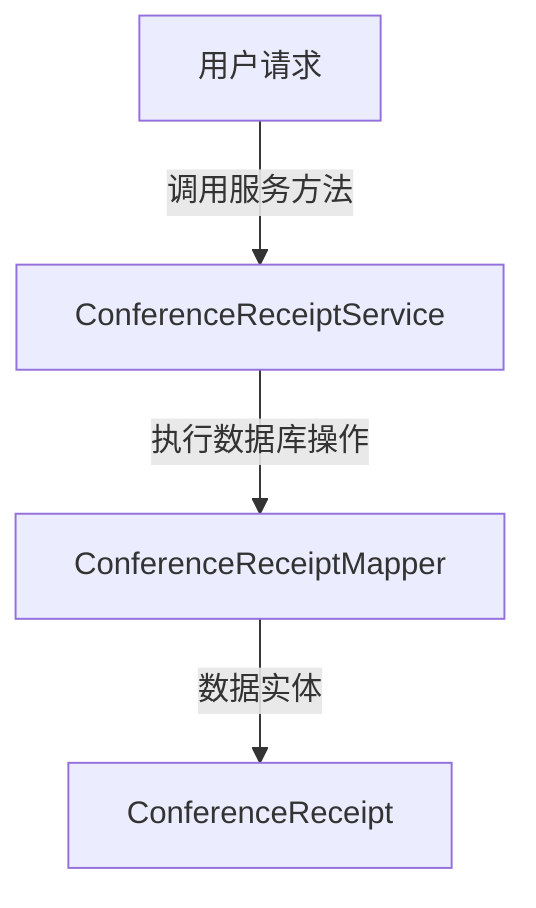
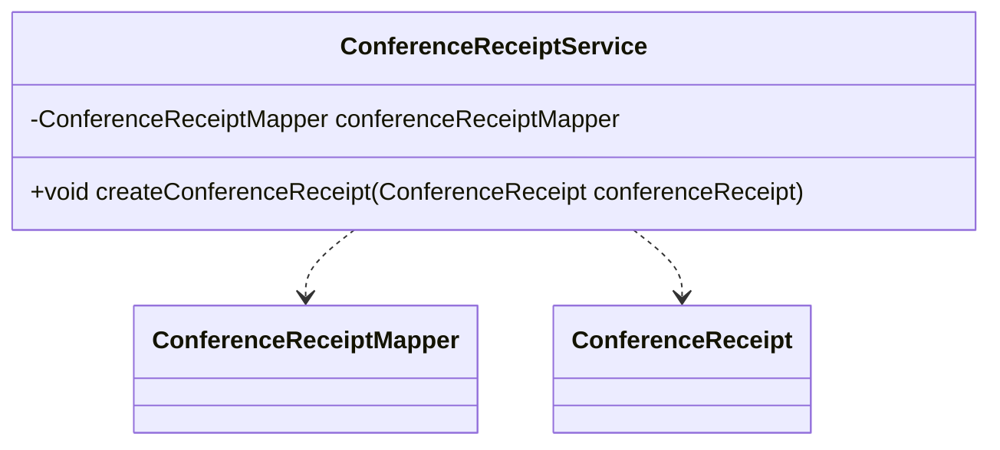

## Conference Receipt Service Module Design

### 模块设计

`ConferenceReceiptService` 模块负责处理会议回执的业务逻辑，主要包括创建会议回执。它作为业务逻辑层的一部分，协调前端请求与数据持久层 (`ConferenceReceiptMapper`) 之间的交互，确保会议回执数据的正确性。

### 模块内设计类的交互模型

该模块主要与 `ConferenceReceiptMapper` 和 `ConferenceReceipt` POJO 进行交互。

### 设计类说明

#### ConferenceReceiptService 类

`ConferenceReceiptService` 类提供了对会议回执数据进行操作的业务方法。它通过依赖注入 `ConferenceReceiptMapper` 来实现数据持久化。

| 属性名                  | 类型                    | 描述                     |
| ----------------------- | ----------------------- | ------------------------ |
| conferenceReceiptMapper | ConferenceReceiptMapper | 用于与数据库交互的映射器 |

| 方法名                  | 返回类型 | 描述             |
| ----------------------- | -------- | ---------------- |
| createConferenceReceipt | void     | 创建新的会议回执 |

