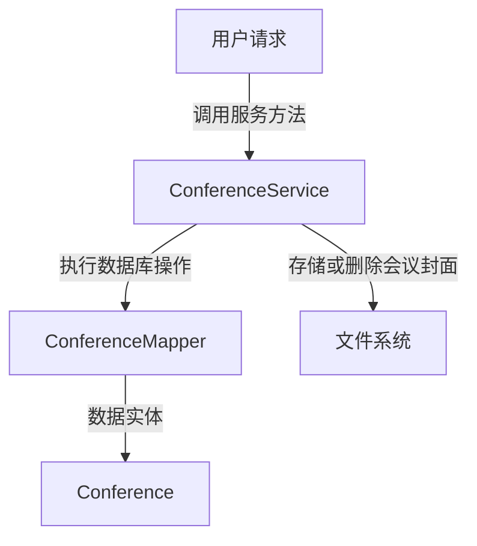
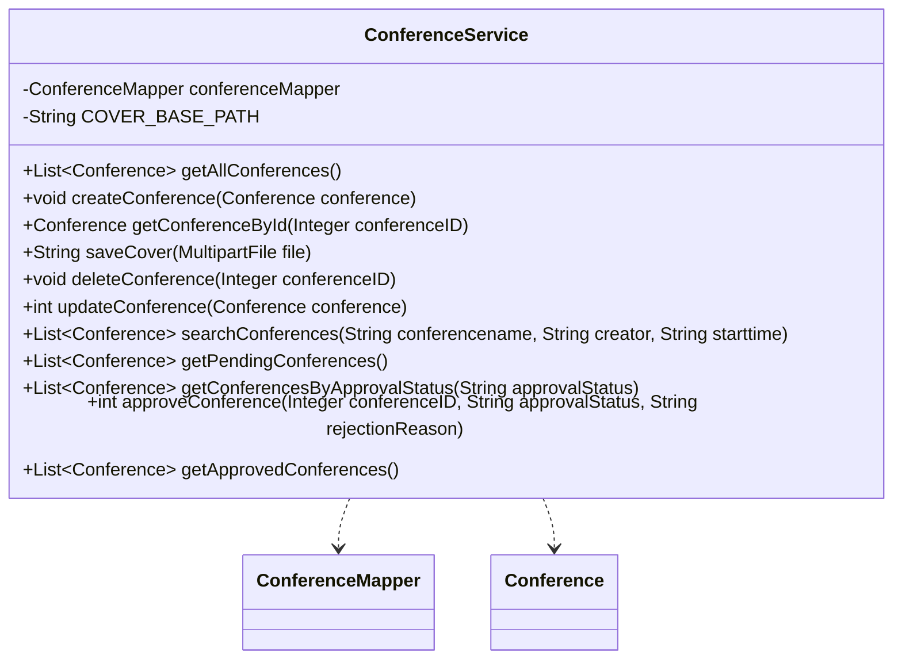

## Conference Service Module Design

### 模块设计

`ConferenceService` 模块负责处理会议的业务逻辑，包括会议的创建、查询、更新、删除、封面上传以及会议的审批流程。它作为业务逻辑层的一部分，协调前端请求与数据持久层 (`ConferenceMapper`) 和文件系统之间的交互，确保会议数据的完整性和操作的正确性。

### 模块内设计类的交互模型

该模块主要与 `ConferenceMapper` 和 `Conference` POJO 进行交互。

### 设计类说明

#### ConferenceService 类

`ConferenceService` 类提供了对会议数据进行操作的业务方法。它通过依赖注入 `ConferenceMapper` 来实现数据持久化，并通过文件 I/O 操作管理会议封面文件。

| 属性名           | 类型             | 描述                     |
| ---------------- | ---------------- | ------------------------ |
| conferenceMapper | ConferenceMapper | 用于与数据库交互的映射器 |
| COVER_BASE_PATH  | String           | 会议封面存储的根路径     |

| 方法名                         | 返回类型         | 描述                                    |
| ------------------------------ | ---------------- | --------------------------------------- |
| getAllConferences              | List<Conference> | 获取所有会议的列表                      |
| createConference               | void             | 创建新的会议                            |
| getConferenceById              | Conference       | 根据会议 ID 获取单个会议信息            |
| saveCover                      | String           | 保存上传的会议封面文件并返回文件路径    |
| deleteConference               | void             | 根据会议 ID 删除会议记录                |
| updateConference               | int              | 更新会议信息                            |
| searchConferences              | List<Conference> | 根据会议名称、创建者、开始时间搜索会议  |
| getPendingConferences          | List<Conference> | 获取所有待审核的会议                    |
| getConferencesByApprovalStatus | List<Conference> | 根据审核状态获取会议                    |
| approveConference              | int              | 审核会议，更新审批状态和拒绝原因        |
| getApprovedConferences         | List<Conference> | 获取所有已审核通过的会议 (用于前端展示) |

