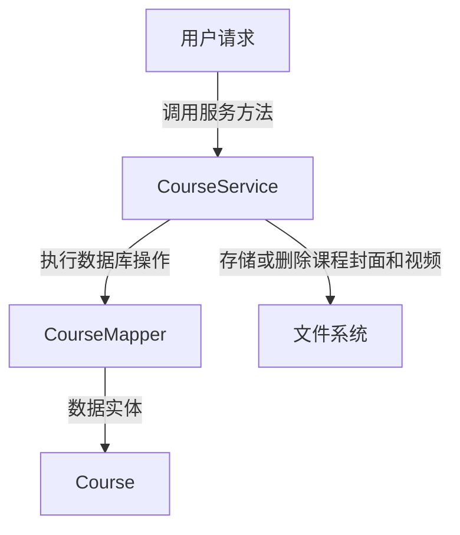
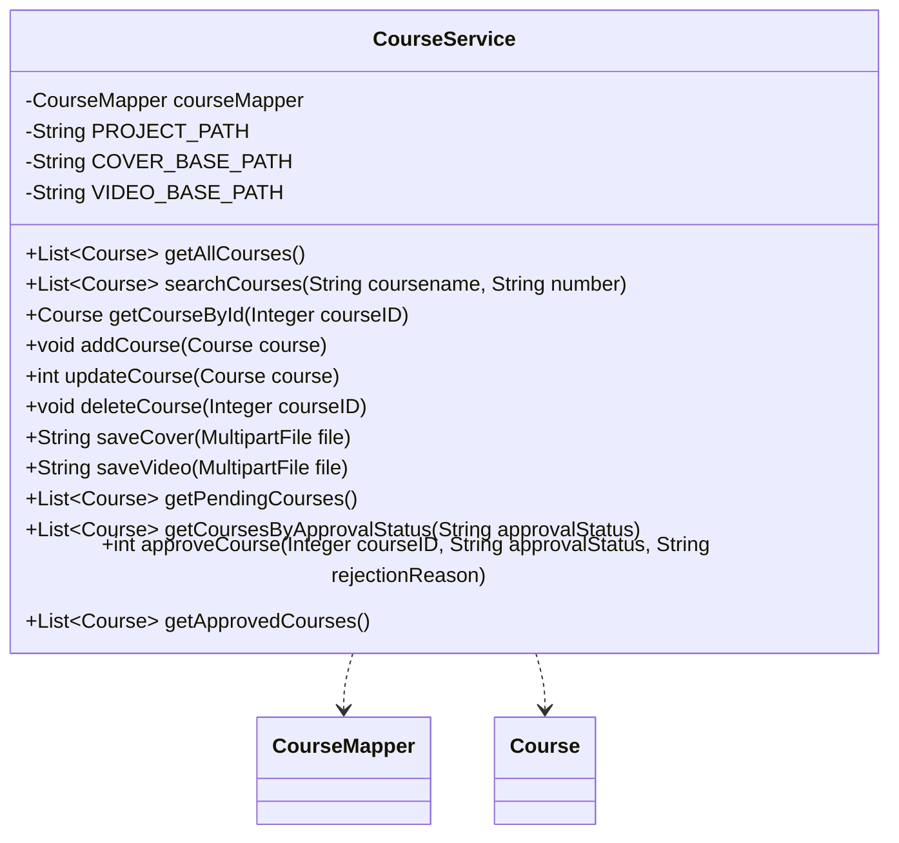

## Course Service Module Design

### 模块设计

`CourseService` 模块负责处理课程的业务逻辑，包括课程的创建、查询、更新、删除、封面和视频的上传以及课程的审批流程。它作为业务逻辑层的一部分，协调前端请求与数据持久层 (`CourseMapper`) 和文件系统之间的交互，确保课程数据的完整性和操作的正确性。

### 模块内设计类的交互模型

该模块主要与 `CourseMapper` 和 `Course` POJO 进行交互。

### 设计类说明

#### CourseService 类

`CourseService` 类提供了对课程数据进行操作的业务方法。它通过依赖注入 `CourseMapper` 来实现数据持久化，并通过文件 I/O 操作管理课程封面和视频文件。

| 属性名          | 类型         | 描述                     |
| --------------- | ------------ | ------------------------ |
| courseMapper    | CourseMapper | 用于与数据库交互的映射器 |
| PROJECT_PATH    | String       | 项目根路径               |
| COVER_BASE_PATH | String       | 课程封面存储的根路径     |
| VIDEO_BASE_PATH | String       | 课程视频存储的根路径     |

| 方法名                     | 返回类型     | 描述                                    |
| -------------------------- | ------------ | --------------------------------------- |
| getAllCourses              | List<Course> | 获取所有课程的列表                      |
| searchCourses              | List<Course> | 根据课程名称和编号搜索课程              |
| getCourseById              | Course       | 根据课程 ID 获取单个课程信息            |
| addCourse                  | void         | 添加新的课程                            |
| updateCourse               | int          | 更新课程信息                            |
| deleteCourse               | void         | 根据课程 ID 删除课程记录                |
| saveCover                  | String       | 保存上传的课程封面文件并返回文件路径    |
| saveVideo                  | String       | 保存上传的视频文件并返回文件路径        |
| getPendingCourses          | List<Course> | 获取所有待审核的课程                    |
| getCoursesByApprovalStatus | List<Course> | 根据审核状态获取课程                    |
| approveCourse              | int          | 审核课程，更新审批状态和拒绝原因        |
| getApprovedCourses         | List<Course> | 获取所有已审核通过的课程 (用于前端展示) |

