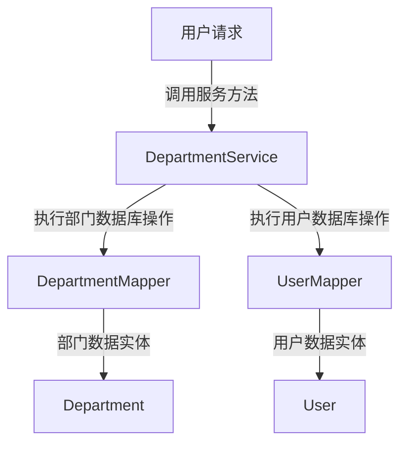
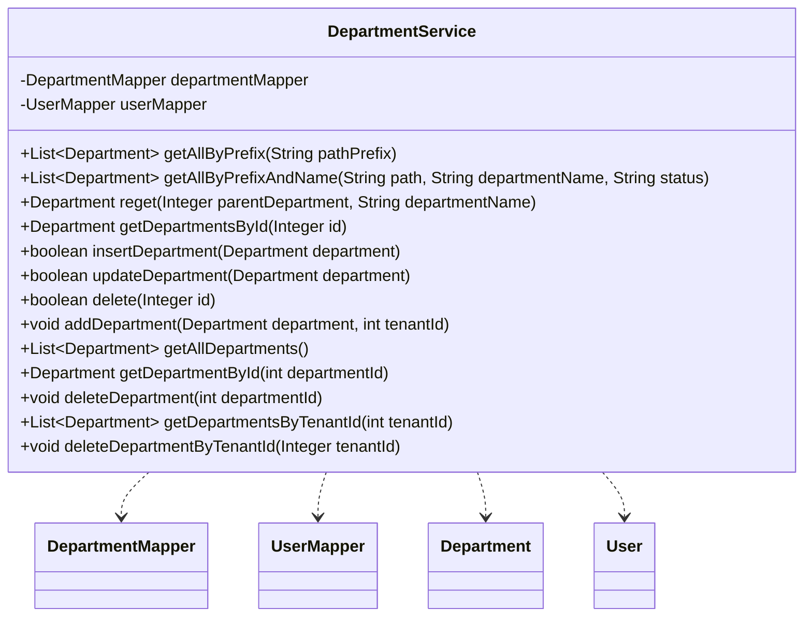

## Department Service Module Design

### 模块设计

`DepartmentService` 模块负责处理部门相关的业务逻辑，包括部门的增删改查以及与部门相关的用户路径更新。它作为业务逻辑层的一部分，协调前端请求与数据持久层 (`DepartmentMapper` 和 `UserMapper`) 之间的交互，确保部门数据及其关联用户数据的完整性和正确性。

### 模块内设计类的交互模型

该模块主要与 `DepartmentMapper`、`UserMapper`、`Department` POJO 和 `User` POJO 进行交互。

### 设计类说明

#### DepartmentService 类

`DepartmentService` 类提供了对部门数据进行操作的业务方法。它通过依赖注入 `DepartmentMapper` 和 `UserMapper` 来实现数据持久化。

| 属性名           | 类型             | 描述                         |
| ---------------- | ---------------- | ---------------------------- |
| departmentMapper | DepartmentMapper | 用于与部门数据库交互的映射器 |
| userMapper       | UserMapper       | 用于与用户数据库交互的映射器 |

| 方法名                     | 返回类型         | 描述                                      |
| -------------------------- | ---------------- | ----------------------------------------- |
| getAllByPrefix             | List<Department> | 根据路径前缀获取所有部门                  |
| getAllByPrefixAndName      | List<Department> | 根据路径、部门名称和状态获取部门          |
| reget                      | Department       | 重新获取部门信息                          |
| getDepartmentsById         | Department       | 根据部门 ID 获取部门信息                  |
| insertDepartment           | boolean          | 插入新部门并更新其路径                    |
| updateDepartment           | boolean          | 更新部门信息及其子部门和用户的路径        |
| delete                     | boolean          | 根据部门 ID 删除部门及其关联用户          |
| addDepartment              | void             | 添加新部门 (事务性操作)                   |
| getAllDepartments          | List<Department> | 获取所有部门的列表                        |
| getDepartmentById          | Department       | 根据部门 ID 获取单个部门信息              |
| deleteDepartment           | void             | 根据部门 ID 删除部门                      |
| getDepartmentsByTenantId   | List<Department> | 根据租户 ID 获取部门列表                  |
| deleteDepartmentByTenantId | void             | 根据租户 ID 删除所有关联部门 (事务性操作) |

