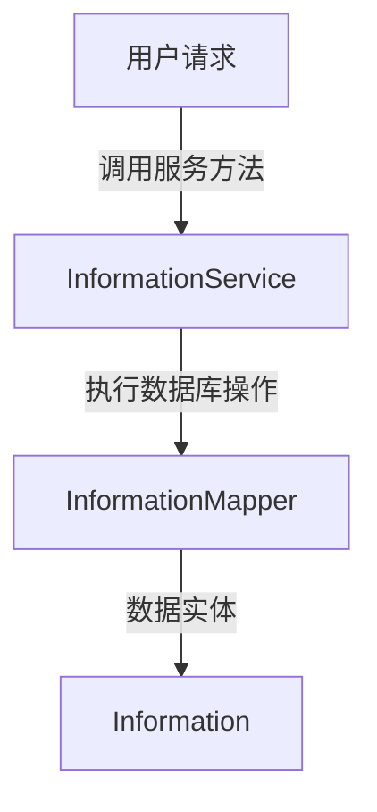
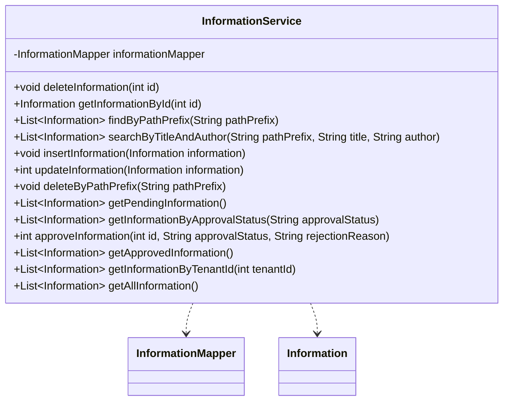

## Information Service Module Design

### 模块设计

`InformationService` 模块负责处理系统中的信息发布和管理业务逻辑，包括信息的增删改查、根据不同条件（如标题、作者、路径前缀和审批状态）进行查询，以及信息的审批流程。它作为业务逻辑层的一部分，协调前端请求与数据持久层 (`InformationMapper`) 之间的交互，确保信息数据的完整性和操作的正确性。

### 模块内设计类的交互模型

该模块主要与 `InformationMapper` 和 `Information` POJO 进行交互。

### 设计类说明

#### InformationService 类

`InformationService` 类提供了对信息数据进行操作的业务方法。它通过依赖注入 `InformationMapper` 来实现数据持久化。

| 属性名            | 类型              | 描述                     |
| ----------------- | ----------------- | ------------------------ |
| informationMapper | InformationMapper | 用于与数据库交互的映射器 |

| 方法名                         | 返回类型          | 描述                                    |
| ------------------------------ | ----------------- | --------------------------------------- |
| deleteInformation              | void              | 根据 ID 删除信息                        |
| getInformationById             | Information       | 根据 ID 获取单个信息                    |
| findByPathPrefix               | List<Information> | 根据路径前缀查找信息                    |
| searchByTitleAndAuthor         | List<Information> | 根据标题和作者搜索信息                  |
| insertInformation              | void              | 插入新信息                              |
| updateInformation              | int               | 更新信息                                |
| deleteByPathPrefix             | void              | 根据路径前缀删除信息                    |
| getPendingInformation          | List<Information> | 获取所有待审核的信息                    |
| getInformationByApprovalStatus | List<Information> | 根据审批状态获取信息                    |
| approveInformation             | int               | 审批信息，更新审批状态和拒绝原因        |
| getApprovedInformation         | List<Information> | 获取所有已审核通过的信息 (用于前端展示) |
| getInformationByTenantId       | List<Information> | 根据租户 ID 获取信息列表                |
| getAllInformation              | List<Information> | 获取所有信息的列表                      |

