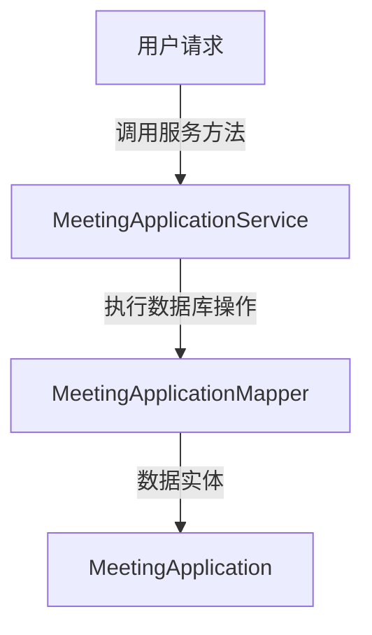
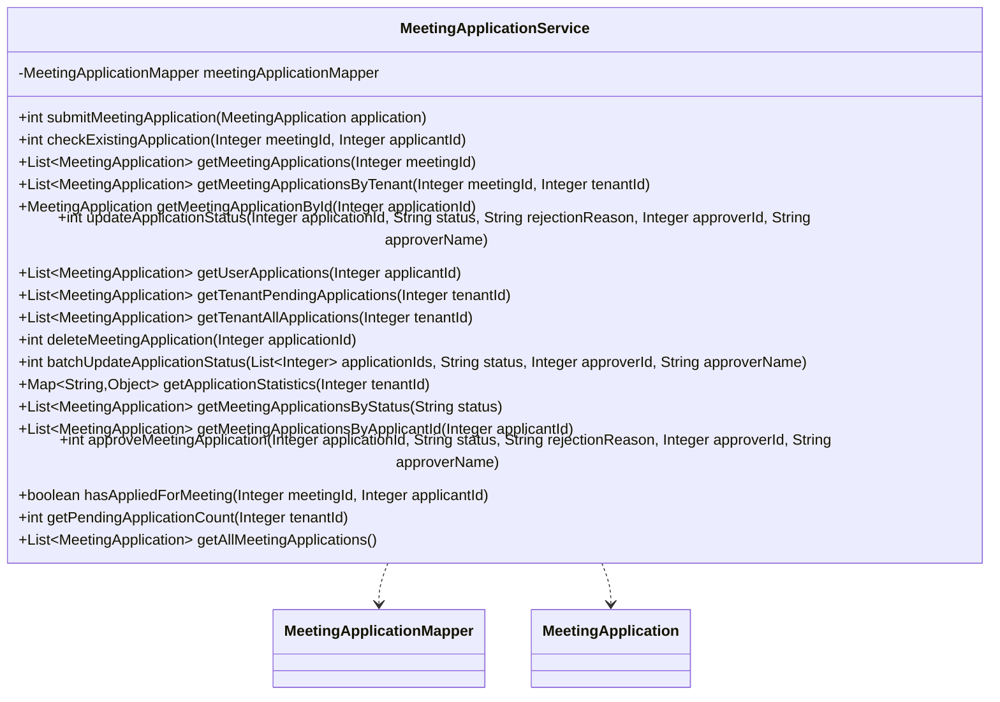

## Meeting Application Service Module Design

### 模块设计

`MeetingApplicationService` 模块负责处理会议申请的各项业务逻辑，包括提交申请、检查重复申请、查询申请（按会议 ID、租户 ID、申请人 ID、状态）、更新申请状态（审批）、删除申请、批量更新申请状态以及获取申请统计信息。它作为业务逻辑层的一部分，协调前端请求与数据持久层 (`MeetingApplicationMapper`) 之间的交互，确保会议申请数据的完整性和操作的正确性。

### 模块内设计类的交互模型

该模块主要与 `MeetingApplicationMapper` 和 `MeetingApplication` POJO 进行交互。

### 设计类说明

#### MeetingApplicationService 类

`MeetingApplicationService` 类提供了对会议申请数据进行操作的业务方法。它通过依赖注入 `MeetingApplicationMapper` 来实现数据持久化。

| 属性名                   | 类型                     | 描述                     |
| ------------------------ | ------------------------ | ------------------------ |
| meetingApplicationMapper | MeetingApplicationMapper | 用于与数据库交互的映射器 |

| 方法名                              | 返回类型                 | 描述                                        |
| ----------------------------------- | ------------------------ | ------------------------------------------- |
| submitMeetingApplication            | int                      | 提交会议申请，并检查是否重复申请            |
| checkExistingApplication            | int                      | 检查是否已经申请过某个会议                  |
| getMeetingApplications              | List<MeetingApplication> | 获取某个会议的所有申请                      |
| getMeetingApplicationsByTenant      | List<MeetingApplication> | 获取某个租户会议的申请 (用于租户管理员查看) |
| getMeetingApplicationById           | MeetingApplication       | 根据 ID 获取申请信息                        |
| updateApplicationStatus             | int                      | 更新申请状态（审批）                        |
| getUserApplications                 | List<MeetingApplication> | 获取用户的所有申请                          |
| getTenantPendingApplications        | List<MeetingApplication> | 获取租户的待审批申请                        |
| getTenantAllApplications            | List<MeetingApplication> | 获取租户的所有申请（包括已审批的）          |
| deleteMeetingApplication            | int                      | 删除申请                                    |
| batchUpdateApplicationStatus        | int                      | 批量更新申请状态                            |
| getApplicationStatistics            | Map<String, Object>      | 获取申请统计信息                            |
| getMeetingApplicationsByStatus      | List<MeetingApplication> | 根据状态获取申请列表                        |
| getMeetingApplicationsByApplicantId | List<MeetingApplication> | 根据申请人 ID 获取申请列表                  |
| approveMeetingApplication           | int                      | 审批会议申请                                |
| hasAppliedForMeeting                | boolean                  | 检查是否已经申请过该会议                    |
| getPendingApplicationCount          | int                      | 获取待审批的申请数量                        |
| getAllMeetingApplications           | List<MeetingApplication> | 获取所有申请（系统管理员用）                |

