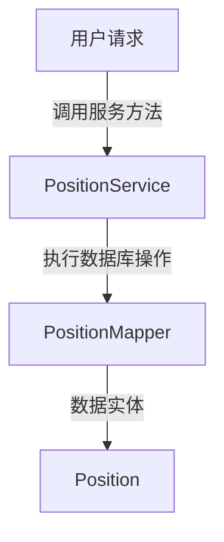
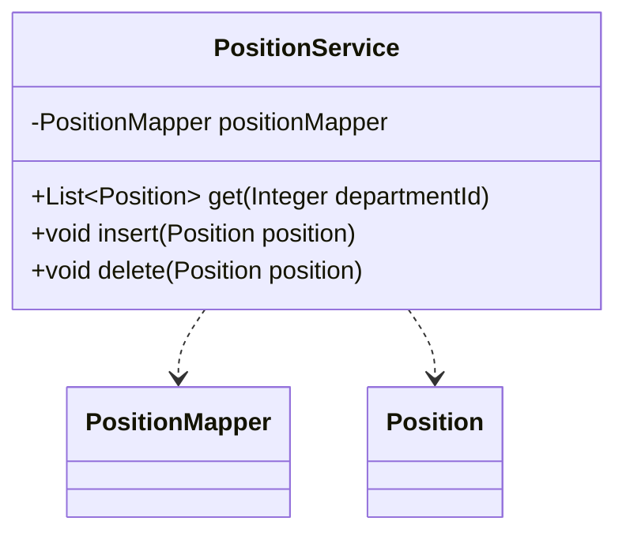

## Position Service Module Design

### 模块设计

`PositionService` 模块负责处理职位相关的业务逻辑，包括职位的查询、添加和删除。它作为业务逻辑层的一部分，协调前端请求与数据持久层 (`PositionMapper`) 之间的交互，确保职位数据的完整性和操作的正确性。

### 模块内设计类的交互模型

该模块主要与 `PositionMapper` 和 `Position` POJO 进行交互。

### 设计类说明

#### PositionService 类

`PositionService` 类提供了对职位数据进行操作的业务方法。它通过依赖注入 `PositionMapper` 来实现数据持久化。

| 属性名         | 类型           | 描述                     |
| -------------- | -------------- | ------------------------ |
| positionMapper | PositionMapper | 用于与数据库交互的映射器 |

| 方法名 | 返回类型       | 描述         |
| ------ | -------------- | ------------ |
| get    | List<Position> | 获取所有职位 |
| insert | void           | 插入新职位   |
| delete | void           | 删除职位     |

