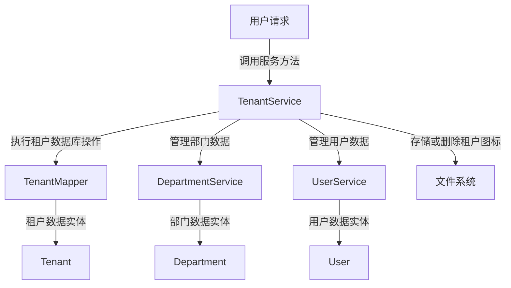
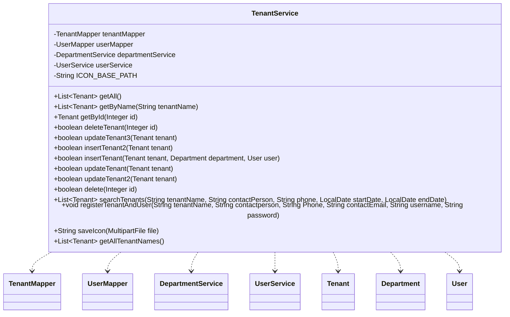

## Tenant Service Module Design

### 模块设计

`TenantService` 模块负责处理租户相关的核心业务逻辑，包括租户的增删改查，以及在租户生命周期中涉及到的部门和用户的级联操作（如删除租户时一并删除其下的部门和用户）。此外，它还处理租户的注册流程和图标上传功能。该服务层通过协调前端请求与多个数据持久层 (`TenantMapper`, `UserMapper`) 和其他服务 (`DepartmentService`, `UserService`) 之间的交互，确保租户数据及其关联数据的完整性和操作的正确性。

### 模块内设计类的交互模型

该模块主要与 `TenantMapper`、`UserMapper`、`DepartmentService`、`UserService` 以及 `Tenant`、`Department`、`User` POJO 进行交互。

### 设计类说明

#### TenantService 类

`TenantService` 类提供了对租户数据进行操作的业务方法。它通过依赖注入 `TenantMapper`、`UserMapper`、`DepartmentService` 和 `UserService` 来实现数据持久化和业务协调。

| 属性名            | 类型              | 描述                         |
| ----------------- | ----------------- | ---------------------------- |
| tenantMapper      | TenantMapper      | 用于与租户数据库交互的映射器 |
| userMapper        | UserMapper        | 用于与用户数据库交互的映射器 |
| departmentService | DepartmentService | 部门业务逻辑服务             |
| userService       | UserService       | 用户业务逻辑服务             |
| ICON_BASE_PATH    | String            | 租户图标存储的根路径         |

| 方法名                | 返回类型     | 描述                                      |
| --------------------- | ------------ | ----------------------------------------- |
| getAll                | List<Tenant> | 获取所有租户的列表                        |
| getByName             | List<Tenant> | 根据租户名称获取租户列表                  |
| getById               | Tenant       | 根据 ID 获取单个租户信息                  |
| deleteTenant          | boolean      | 删除租户及其关联的部门和用户 (事务性操作) |
| updateTenant3         | boolean      | 更新租户信息（不涉及级联操作）            |
| insertTenant2         | boolean      | 插入新租户（不涉及级联操作，事务性操作）  |
| insertTenant          | boolean      | 插入新租户及其关联的部门和用户            |
| updateTenant          | boolean      | 更新租户信息                              |
| updateTenant2         | boolean      | 更新租户信息（基于特定字段）              |
| delete                | boolean      | 删除租户及其关联的根部门                  |
| searchTenants         | List<Tenant> | 根据名称、联系人、电话、日期范围搜索租户  |
| registerTenantAndUser | void         | 注册新租户和管理员用户                    |
| saveIcon              | String       | 保存上传的租户图标文件并返回文件路径      |
| getAllTenantNames     | List<Tenant> | 获取所有租户名称的列表                    |

