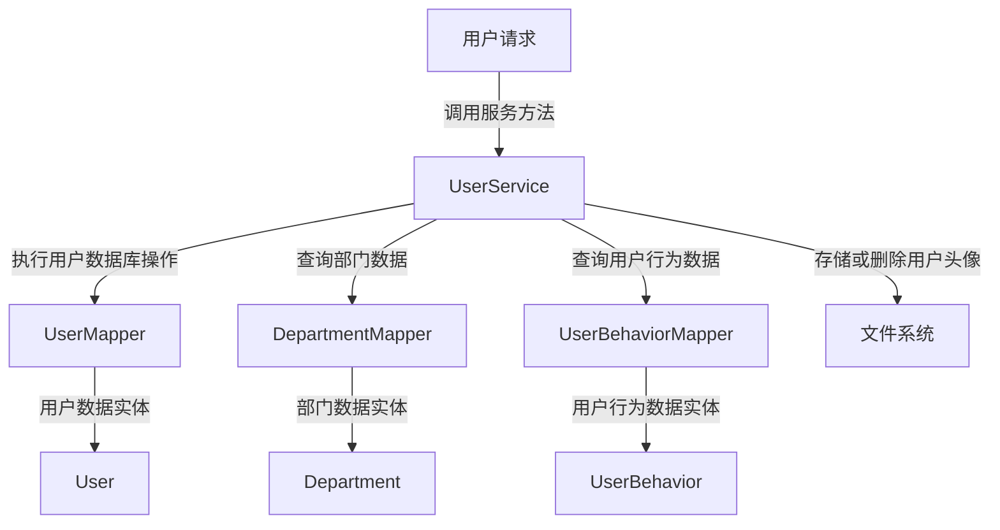
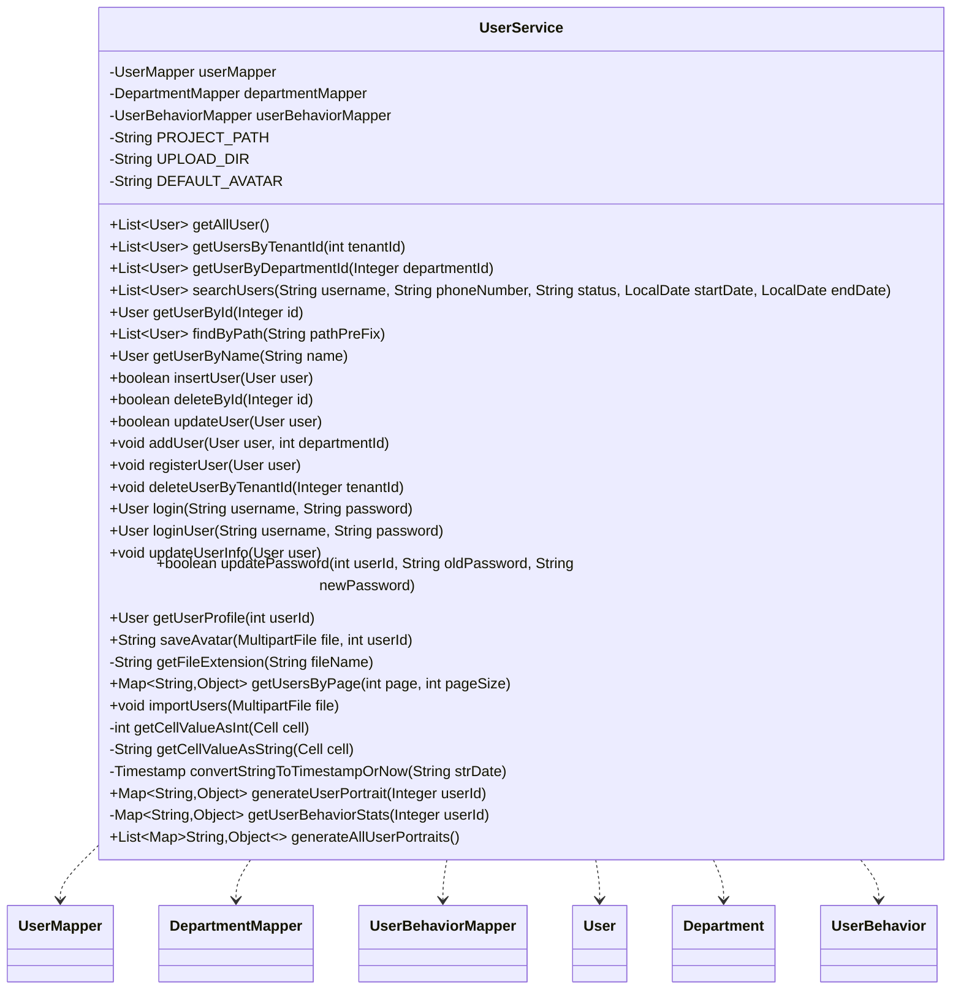

## User Service Module Design

### 模块设计

`UserService` 模块负责处理用户相关的核心业务逻辑，包括用户的增删改查、登录认证、密码管理、个人资料更新、头像上传、用户导入、用户行为画像生成以及用户增长统计。它作为业务逻辑层的一部分，协调前端请求与多个数据持久层 (`UserMapper`, `DepartmentMapper`, `UserBehaviorMapper`) 和文件系统之间的交互，确保用户数据及其关联数据的完整性和操作的正确性。

### 模块内设计类的交互模型

该模块主要与 `UserMapper`、`DepartmentMapper`、`UserBehaviorMapper` 以及 `User`、`Department`、`UserBehavior` POJO 进行交互，并涉及文件系统进行文件存储。

### 设计类说明

#### UserService 类

`UserService` 类提供了对用户数据进行操作的业务方法。它通过依赖注入 `UserMapper`、`DepartmentMapper` 和 `UserBehaviorMapper` 来实现数据持久化和业务协调。

| 属性名             | 类型               | 描述                             |
| ------------------ | ------------------ | -------------------------------- |
| userMapper         | UserMapper         | 用于与用户数据库交互的映射器     |
| departmentMapper   | DepartmentMapper   | 用于与部门数据库交互的映射器     |
| userBehaviorMapper | UserBehaviorMapper | 用于与用户行为数据库交互的映射器 |
| PROJECT_PATH       | String             | 项目根路径                       |
| UPLOAD_DIR         | String             | 头像上传目录                     |
| DEFAULT_AVATAR     | String             | 默认头像路径                     |

| 方法名                        | 返回类型                  | 描述                                     |
| ----------------------------- | ------------------------- | ---------------------------------------- |
| getAllUser                    | List<User>                | 获取所有用户列表                         |
| getUsersByTenantId            | List<User>                | 根据租户 ID 获取用户列表                 |
| getUserByDepartmentId         | List<User>                | 根据部门 ID 获取用户列表                 |
| searchUsers                   | List<User>                | 根据用户名、电话、状态和日期范围搜索用户 |
| getUserById                   | User                      | 根据 ID 获取用户                         |
| findByPath                    | List<User>                | 根据部门路径前缀查找用户                 |
| getUserByName                 | User                      | 根据用户名获取用户                       |
| insertUser                    | boolean                   | 插入新用户                               |
| deleteById                    | boolean                   | 根据 ID 删除用户                         |
| updateUser                    | boolean                   | 更新用户所有信息                         |
| addUser                       | void                      | 添加用户 (事务性操作)                    |
| registerUser                  | void                      | 注册新用户 (密码未加密处理)              |
| deleteUserByTenantId          | void                      | 根据租户 ID 删除用户 (事务性操作)        |
| login                         | User                      | 用户登录认证                             |
| loginUser                     | User                      | 用户登录认证，抛出异常                   |
| updateUserInfo                | void                      | 更新用户个人信息                         |
| updatePassword                | boolean                   | 更新用户密码                             |
| getUserProfile                | User                      | 获取用户个人资料，处理默认头像           |
| saveAvatar                    | String                    | 保存用户头像文件                         |
| getFileExtension              | String                    | 获取文件扩展名                           |
| getUsersByPage                | Map<String, Object>       | 分页获取用户列表                         |
| importUsers                   | void                      | 从 Excel 文件导入用户数据                |
| getCellValueAsInt             | int                       | 从单元格获取整数值                       |
| getCellValueAsString          | String                    | 从单元格获取字符串值                     |
| convertStringToTimestampOrNow | Timestamp                 | 将字符串转换为时间戳，或返回当前时间     |
| generateUserPortrait          | Map<String, Object>       | 根据用户 ID 生成用户画像                 |
| getUserBehaviorStats          | Map<String, Object>       | 获取用户行为统计数据                     |
| generateAllUserPortraits      | List<Map<String, Object>> | 生成所有用户的画像                       |

