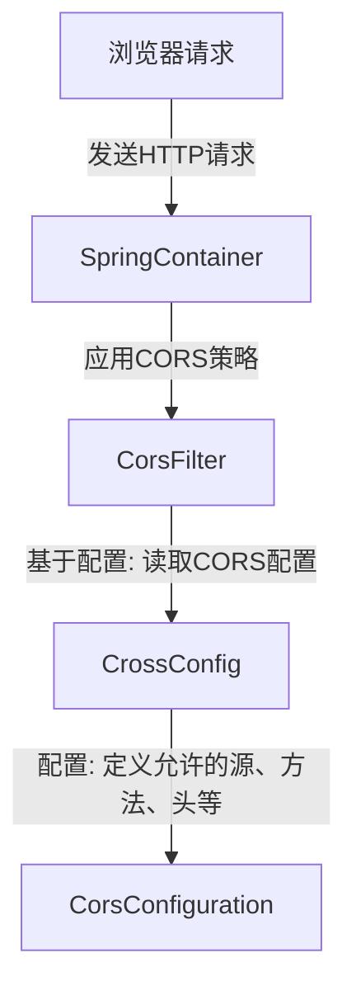
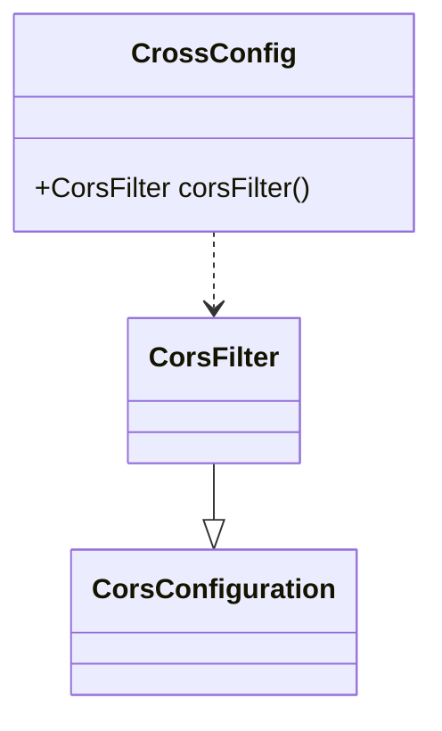

## CrossConfig Module Design

### 模块设计

`CrossConfig` 模块负责配置应用程序的**跨域资源共享 (CORS)** 策略。它通过 Spring Framework 的 `@Configuration` 注解定义了一个 `CorsFilter` Bean，用于允许来自特定来源的 HTTP 请求访问后端资源。这对于前后端分离的应用至关重要，因为它解决了浏览器安全策略导致的跨域问题。

### 模块内设计类的交互模型

`CrossConfig` 类主要与 Spring Framework 的 CORS 机制进行交互，通过定义 `CorsConfiguration` 来影响 HTTP 请求的处理。

### 设计类说明

#### CrossConfig 类

`CrossConfig` 类是一个 Spring 配置类，通过 `@Configuration` 注解声明。它提供了一个 `corsFilter` Bean，该 Bean 配置了详细的 CORS 规则，包括允许的源、请求方法、请求头以及是否允许携带凭证。

| 属性名 | 类型 | 描述 |
| ------ | ---- | ---- |
| 无     | 无   | 无   |

| 方法名     | 返回类型   | 描述                                                                                             |
| ---------- | ---------- | ------------------------------------------------------------------------------------------------ |
| corsFilter | CorsFilter | 配置并返回一个 `CorsFilter` 实例，该实例定义了应用程序的 CORS 策略，允许来自指定来源的跨域请求。 |

