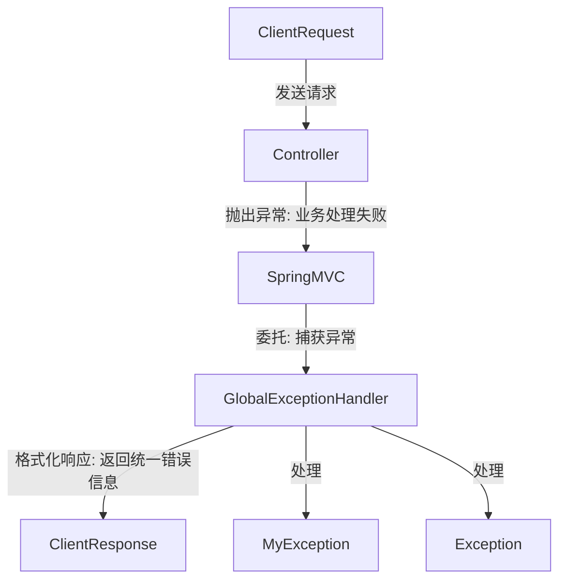
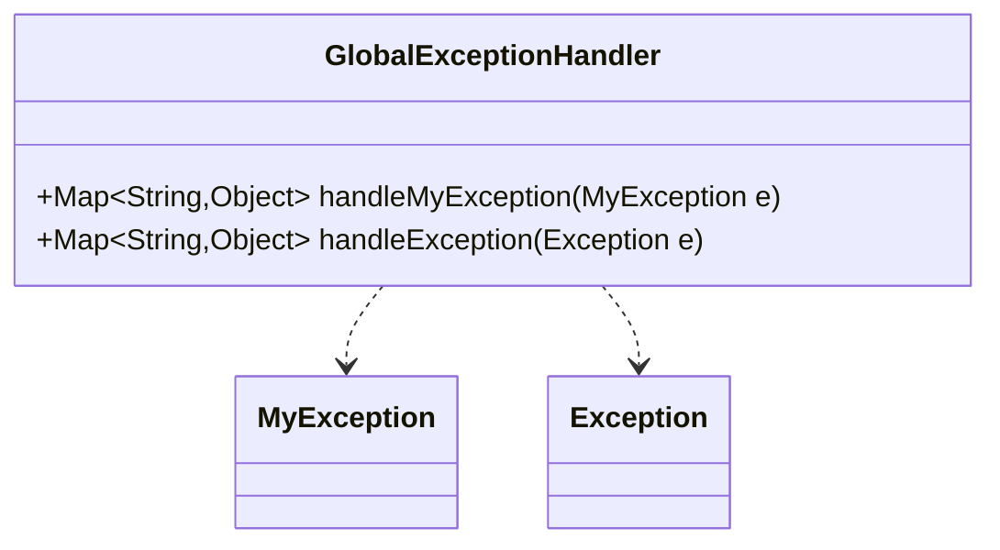

## Global Exception Handler Module Design

### 模块设计

`GlobalExceptionHandler` 模块负责集中处理应用程序中抛出的各种异常，提供统一的异常响应格式。它通过 Spring Framework 的 `@RestControllerAdvice` 注解实现全局异常捕获，从而避免在每个控制器方法中编写重复的异常处理逻辑，提高代码的整洁性和可维护性。该模块能够捕获自定义异常 (`MyException`) 和所有其他未被特定处理的异常 (`Exception`)。

### 模块内设计类的交互模型

`GlobalExceptionHandler` 作为 Spring MVC 的一个 AOP (Aspect-Oriented Programming) 切面，拦截控制器层抛出的异常，并将其转换为统一的 JSON 响应格式返回给客户端。

### 设计类说明

#### GlobalExceptionHandler 类

`GlobalExceptionHandler` 类是一个 Spring 的全局异常处理组件，通过 `@RestControllerAdvice` 注解使其能够对所有 `@Controller` 或 `@RestController` 定义的控制器进行异常处理。它包含多个 `@ExceptionHandler` 注解的方法，用于处理特定类型的异常。

| 属性名 | 类型 | 描述 |
| ------ | ---- | ---- |
| 无     | 无   | 无   |

| 方法名            | 参数          | 返回类型            | 描述                                                             |
| ----------------- | ------------- | ------------------- | ---------------------------------------------------------------- |
| handleMyException | MyException e | Map<String, Object> | 捕获并处理自定义的 `MyException`，返回包含错误信息的 Map。       |
| handleException   | Exception e   | Map<String, Object> | 捕获并处理所有其他未被特定处理的 `Exception`，返回通用错误信息。 |

