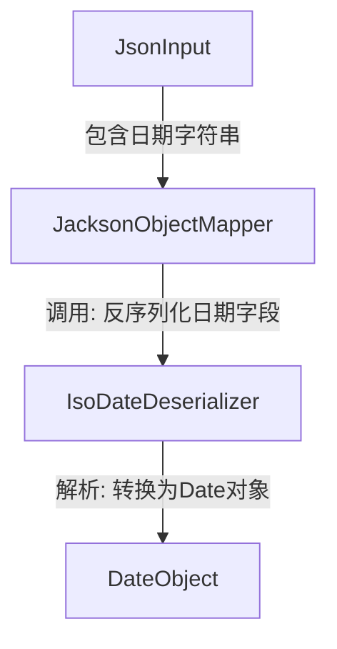
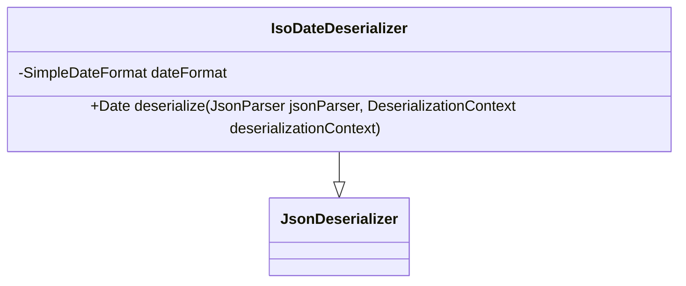

## ISO Date Deserializer Module Design

### 模块设计

`IsoDateDeserializer` 模块是一个自定义的 JSON 反序列化器，用于将特定格式（ISO 8601 格式，如 `yyyy-MM-dd'T'HH:mm:ss.SSSX`）的日期字符串转换为 Java 的 `java.util.Date` 对象。这在处理从前端或外部系统接收到的日期数据时非常有用，确保日期格式的正确解析。

### 模块内设计类的交互模型

该模块主要作为 Jackson 库的一部分，在 JSON 反序列化过程中被调用，将日期字符串转换为 `Date` 对象。

### 设计类说明

#### IsoDateDeserializer 类

`IsoDateDeserializer` 类继承自 `com.fasterxml.jackson.databind.JsonDeserializer<Date>`，重写了 `deserialize` 方法来实现自定义的日期反序列化逻辑。它使用 `SimpleDateFormat` 来解析 ISO 8601 格式的日期字符串。

| 属性名     | 类型             | 描述                         |
| ---------- | ---------------- | ---------------------------- |
| dateFormat | SimpleDateFormat | 用于解析日期字符串的格式化器 |

| 方法名      | 参数                                                                 | 返回类型 | 描述                                               |
| ----------- | -------------------------------------------------------------------- | -------- | -------------------------------------------------- |
| deserialize | JsonParser jsonParser, DeserializationContext deserializationContext | Date     | 从 JSON 输入中读取日期字符串并解析为 `Date` 对象。 |

