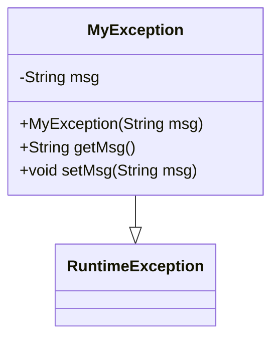

## MyException Module Design

### 模块设计

`MyException` 模块定义了一个自定义的运行时异常类，用于在应用程序中表示特定的业务或系统错误。通过自定义异常，可以提供更具体的错误信息，并与全局异常处理机制 (`GlobalExceptionHandler`) 协同工作，实现统一的错误响应。

### 设计类说明

#### MyException 类

`MyException` 类继承自 `RuntimeException`，表示这是一个非受检异常。它包含一个 `msg` 属性用于存储异常的详细描述信息。

| 属性名 | 类型   | 描述     |
| ------ | ------ | -------- |
| msg    | String | 异常消息 |

| 方法名      | 参数       | 返回类型 | 描述             |
| ----------- | ---------- | -------- | ---------------- |
| MyException | String msg | 构造函数 | 初始化异常消息。 |
| getMsg      | 无         | String   | 获取异常消息。   |
| setMsg      | String msg | void     | 设置异常消息。   |

