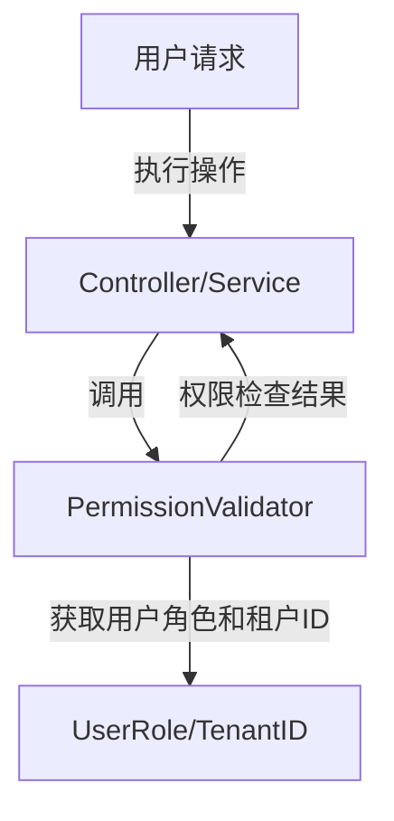
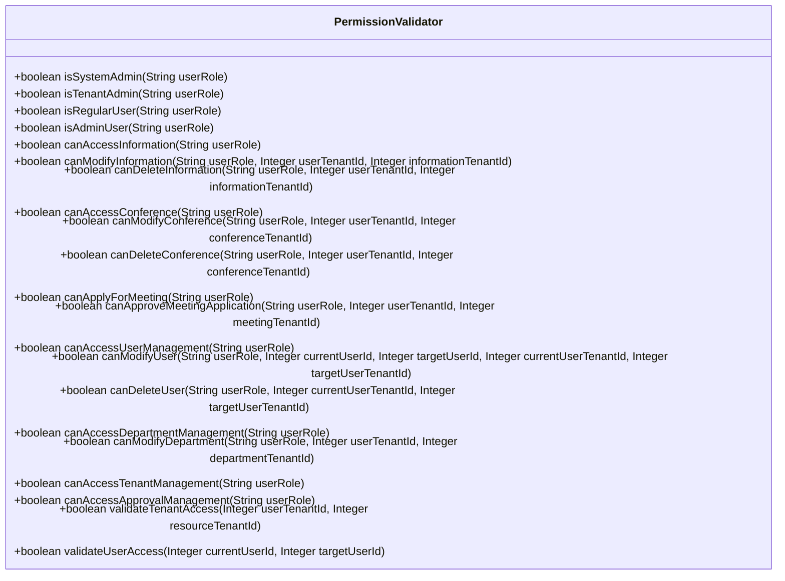

## Permission Validator Module Design

### 模块设计

`PermissionValidator` 模块是一个权限验证工具类，负责提供应用程序中各种操作和资源访问的权限检查逻辑。它封装了基于用户角色和租户 ID 的权限判断规则，例如系统管理员、租户管理员和普通用户的不同权限。该模块旨在集中管理权限验证逻辑，确保系统的安全性和数据隔离。

### 模块内设计类的交互模型

`PermissionValidator` 类作为一个独立的工具组件，通常在 Service 层或 Controller 层被调用，用于在执行具体业务逻辑之前进行权限检查。

### 设计类说明

#### PermissionValidator 类

`PermissionValidator` 类通过 `@Component` 注解声明为 Spring 组件，可以在其他服务中进行依赖注入和使用。它包含一系列方法，每个方法对应一种权限检查逻辑，根据传入的用户角色、用户 ID 和租户 ID 来判断用户是否具有执行特定操作或访问特定资源的权限。

| 属性名 | 类型 | 描述 |
| ------ | ---- | ---- |
| 无     | 无   | 无   |

| 方法名                        | 参数                                                                                                                  | 返回类型 | 描述                                                   |
| ----------------------------- | --------------------------------------------------------------------------------------------------------------------- | -------- | ------------------------------------------------------ |
| isSystemAdmin                 | String userRole                                                                                                       | boolean  | 检查用户是否为系统管理员。                             |
| isTenantAdmin                 | String userRole                                                                                                       | boolean  | 检查用户是否为租户管理员。                             |
| isRegularUser                 | String userRole                                                                                                       | boolean  | 检查用户是否为普通用户。                               |
| isAdminUser                   | String userRole                                                                                                       | boolean  | 检查用户是否具有管理员权限（系统管理员或租户管理员）。 |
| canAccessInformation          | String userRole                                                                                                       | boolean  | 检查用户是否可以访问资讯管理。                         |
| canModifyInformation          | String userRole, Integer userTenantId, Integer informationTenantId                                                    | boolean  | 检查用户是否可以修改特定资讯。                         |
| canDeleteInformation          | String userRole, Integer userTenantId, Integer informationTenantId                                                    | boolean  | 检查用户是否可以删除特定资讯。                         |
| canAccessConference           | String userRole                                                                                                       | boolean  | 检查用户是否可以访问会议管理。                         |
| canModifyConference           | String userRole, Integer userTenantId, Integer conferenceTenantId                                                     | boolean  | 检查用户是否可以修改特定会议。                         |
| canDeleteConference           | String userRole, Integer userTenantId, Integer conferenceTenantId                                                     | boolean  | 检查用户是否可以删除特定会议。                         |
| canApplyForMeeting            | String userRole                                                                                                       | boolean  | 检查用户是否可以申请参加会议。                         |
| canApproveMeetingApplication  | String userRole, Integer userTenantId, Integer meetingTenantId                                                        | boolean  | 检查用户是否可以审批会议申请。                         |
| canAccessUserManagement       | String userRole                                                                                                       | boolean  | 检查用户是否可以访问用户管理。                         |
| canModifyUser                 | String userRole, Integer currentUserId, Integer targetUserId, Integer currentUserTenantId, Integer targetUserTenantId | boolean  | 检查用户是否可以修改特定用户信息。                     |
| canDeleteUser                 | String userRole, Integer currentUserTenantId, Integer targetUserTenantId                                              | boolean  | 检查用户是否可以删除特定用户。                         |
| canAccessDepartmentManagement | String userRole                                                                                                       | boolean  | 检查用户是否可以访问部门管理。                         |
| canModifyDepartment           | String userRole, Integer userTenantId, Integer departmentTenantId                                                     | boolean  | 检查用户是否可以修改部门。                             |
| canAccessTenantManagement     | String userRole                                                                                                       | boolean  | 检查用户是否可以访问租户管理。                         |
| canAccessApprovalManagement   | String userRole                                                                                                       | boolean  | 检查用户是否可以访问审核管理。                         |
| validateTenantAccess          | Integer userTenantId, Integer resourceTenantId                                                                        | boolean  | 验证租户 ID 是否匹配。                                 |
| validateUserAccess            | Integer currentUserId, Integer targetUserId                                                                           | boolean  | 验证用户 ID 是否匹配。                                 |

