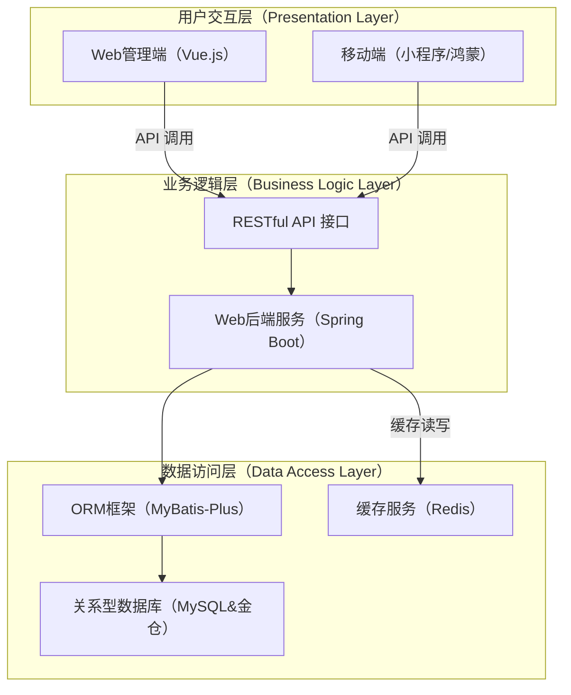
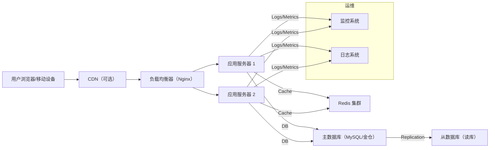

<<<<<<< HEAD
# 测盟汇系统前端美化

## 概述

本次前端美化采用了现代化的设计风格，将原本的若依风格界面改造为更加美观、现代化的用户界面。

## 主要改进

### 1. 整体布局优化
- **移除侧边栏**：将导航菜单整合到顶部导航栏中
- **现代化导航**：采用下拉菜单形式组织功能模块
- **响应式设计**：支持移动端和桌面端的自适应布局

### 2. 视觉设计升级
- **渐变背景**：使用现代化的渐变背景色
- **毛玻璃效果**：卡片采用半透明毛玻璃效果
- **圆角设计**：统一使用圆角设计语言
- **阴影效果**：添加层次感的阴影效果

### 3. 组件美化
- **按钮样式**：现代化的按钮设计，包含悬停效果
- **表单控件**：美化的输入框、选择器等表单组件
- **表格样式**：现代化的表格设计，包含条纹和边框
- **对话框**：美化的弹窗和对话框设计

### 4. 页面重构

#### 登录页面
- 左右分栏布局，左侧展示系统信息
- 右侧为登录表单
- 添加动画效果和装饰元素
- 现代化的表单验证和交互

#### 首页
- 统计面板展示关键数据
- 轮播图展示系统动态
- 协会简介卡片式布局
- 合作成员网格展示

#### 用户管理页面
- 左侧组织架构树
- 右侧用户列表和操作
- 现代化的搜索和筛选功能
- 美化的表格和分页

#### 顶部导航栏
- 整合所有功能模块的导航
- 用户信息下拉菜单
- 面包屑导航
- 响应式设计

## 技术特性

### 1. CSS变量系统
```css
:root {
  --primary-color: #667eea;
  --primary-gradient: linear-gradient(135deg, #667eea 0%, #764ba2 100%);
  --border-radius: 12px;
  --shadow-md: 0 8px 32px rgba(0, 0, 0, 0.1);
  --transition: all 0.3s ease;
}
```

### 2. 现代化组件样式
- 统一的圆角设计
- 一致的阴影效果
- 平滑的过渡动画
- 悬停交互效果

### 3. 响应式布局
- 移动端适配
- 平板端优化
- 桌面端完整功能

## 文件结构

```
web前端/
├── App.vue                 # 主应用组件（已美化）
├── uni.scss               # 全局样式文件（已更新）
├── pages/
│   ├── components/
│   │   ├── TopBar.vue     # 顶部导航栏（已美化）
│   │   └── SideBar.vue    # 侧边栏（已移除）
│   ├── views/
│   │   ├── login.vue      # 登录页面（已美化）
│   │   └── home.vue       # 首页（已美化）
│   └── UserManagement.vue # 用户管理页面（已美化）
└── README.md              # 本文档
```

## 使用说明

### 1. 启动项目
```bash
npm install
npm run dev
```

### 2. 访问页面
- 登录页面：`/`
- 首页：`/home`
- 用户管理：`/user-management`

### 3. 主要功能
- 用户登录和注册
- 用户管理（增删改查）
- 部门管理
- 租户管理
- 课程管理
- 资讯管理
- 会议管理
- 用户行为分析

## 设计理念

### 1. 现代化
- 采用最新的设计趋势
- 简洁明了的界面布局
- 优雅的视觉效果

### 2. 用户体验
- 直观的操作流程
- 清晰的视觉层次
- 流畅的交互动画

### 3. 可维护性
- 统一的样式规范
- 模块化的组件设计
- 清晰的代码结构

## 浏览器兼容性

- Chrome 80+
- Firefox 75+
- Safari 13+
- Edge 80+

## 后续优化建议

1. **性能优化**
   - 图片懒加载
   - 组件按需加载
   - 代码分割

2. **功能增强**
   - 主题切换功能
   - 国际化支持
   - 更多动画效果

3. **用户体验**
   - 加载状态优化
   - 错误处理改进
   - 无障碍访问支持

## 联系方式

如有问题或建议，请联系开发团队。 
=======
# 测盟汇 | 智创联盟队：新一代智能测试与质量管理平台


---

## 目录

- [1. 项目概览](#1-项目概览)
- [2. 核心功能](#2-核心功能)
  - [2.1. Web 管理端功能](#21-web管理端功能)
  - [2.2. 移动端功能 (微信小程序 & 鸿蒙应用)](#22-移动端功能-微信小程序--鸿蒙应用)
- [3. 创新与亮点](#3-创新与亮点)
- [4. 技术栈](#4-技术栈)
- [5. 系统架构](#5-系统架构)
  - [5.1. 逻辑架构 (三层架构)](#51-逻辑架构-三层架构)
  - [5.2. 核心部署架构 (高层)](#52-核心部署架构-高层)
- [6. 项目结构](#6-项目结构)
- [7. 快速开始](#7-快速开始)
  - [7.1. 环境要求](#71-环境要求)
  - [7.2. 后端服务启动](#72-后端服务启动)
  - [7.3. Web 管理端启动](#73-web管理端启动)
  - [7.4. 微信小程序启动](#74-微信小程序启动)
  - [7.5. 鸿蒙应用启动 (挑战任务)](#75-鸿蒙应用启动-挑战任务)
- [8. 使用指南](#8-使用指南)
- [9. 测试策略](#9-测试策略)
- [10. 部署与运维](#10-部署与运维)
- [11. 未来展望](#11-未来展望)
- [12. 团队成员](#12-团队成员)
- [13. 贡献指南](#13-贡献指南)
- [14. 许可证](#14-许可证)
- [15. 联系我们](#15-联系我们)

---

### 1. 项目概览

“测盟汇”是一个面向“电子质量管理协会计算机软硬件和信息系统质量测评分会”等专业组织的综合性在线测试与质量管理平台。针对当前会议组织效率低、信息发布散乱、学习资源分散、优秀报告难以回放等痛点，本项目致力于构建一个集**在线会议管理、行业动态发布、专业课程学习**及**用户与权限管理**为一体的数字化平台。

**我们的目标** 是通过 Web 管理端和移动端应用，提升组织运营效率，集中优质资源，优化用户体验，并探索前沿技术（如 AI、国产化适配、多端融合）在实际业务场景中的应用，为用户提供一个高效、稳定、智能化的知识共享与管理生态。

### 2. 核心功能

“测盟汇”系统提供 Web 管理端和移动端两大核心功能模块，共同支撑业务运营：

#### 2.1. Web 管理端功能

面向超级管理员和企业用户，提供全面的后台管理和数据操作能力：

- **用户与权限管理：** 支持企业注册、多角色（超管、企业用户）登录、用户资料增删改查、以及基于角色的细粒度权限控制。
- **行业动态管理：** 动态的发布、审核、编辑、删除、浏览和搜索功能，支持富文本内容及图文混排。
- **课程管理：** 课程的增删改查、管理员审核流程、课程上下架管理。
- **会议管理：** 会议的创建、发布、审核、编辑、删除、浏览、详情查看及报名数据管理。
- **数据统计与分析：** 提供基础运营数据的可视化报表，如用户活跃趋势、内容发布量、浏览量等。

#### 2.2. 移动端功能 (微信小程序 & 鸿蒙应用)

面向普通用户和参与者，提供便捷的信息获取和业务参与渠道：

- **用户登录与个人中心：** 支持账号密码登录和第三方快速登录（如微信），用户可管理个人资料及查看参与记录。
- **会议浏览与报名：** 会议列表展示（支持下拉刷新/上拉加载）、详情查看、在线填写参会回执，并可关联跳转至外部小程序。
- **行业动态浏览与搜索：** 动态列表展示、模糊搜索、图文详情查看，优化阅读体验。

### 3. 创新与亮点

本项目不仅完成了课程要求的核心功能，更在以下多个方面进行了深入探索和高质量实践，力求打造一个领先的、富有前瞻性的系统：

- **AI 赋能：智能内容推荐与摘要**
  - **个性化推荐：** 基于用户浏览行为和偏好，智能推荐相关的行业动态、课程及会议，提升信息获取效率。
  - **智能摘要（探索）：** 尝试利用大模型技术对会议/报告内容进行自动化摘要，方便用户快速掌握核心要点。
- **国产化适配：金仓数据库集成**
  - 核心业务数据（用户、会议、行业动态）存储在**国产金仓数据库 (KingbaseES)** 上，验证了系统在信创环境下的兼容性与稳定性。
  - 积累了国产数据库适配与优化的实践经验。
- **多端融合：鸿蒙应用核心功能实现**
  - 除微信小程序外，率先在**鸿蒙（HarmonyOS）**平台上实现了用户登录、会议浏览、报名等核心功能，初步探索了鸿蒙分布式能力，为未来全场景体验奠定基础。
- **精细化数据可视化：运营数据洞察**
  - Web 管理端提供直观的图表，将复杂的后台数据转化为可视化报表，为运营和决策提供数据支持，并初步探索用户行为分析。
- **高质量工程实践：**
  - **严格的编码规范与代码审查：** 确保代码质量和可维护性。
  - **全面的单元测试与高覆盖率：** 核心功能实现 **100%** 代码覆盖率，辅助功能 **≥80%**，保障代码健壮性。
  - **自动化部署 (CI/CD)：** 集成 **GitHub Actions** 自动化构建、测试与部署流程，提高交付效率。
  - **容器化探索：** 实践 **Docker** 容器化部署，提高环境一致性与可移植性，并展望 **Kubernetes** 编排。
  - **无障碍设计：** 初步融入无障碍设计原则，提升系统包容性与用户体验。
- **安全加固：多层安全防护**
  - 采用 **JWT** 无状态认证、**Spring Security** RBAC 权限控制。
  - 数据传输 **HTTPS** 加密，敏感数据 **加盐哈希** 存储。
  - 全面防范 **SQL 注入、XSS、CSRF** 等常见攻击。
  - 实现**安全日志审计与异常行为检测**，提升系统主动防御能力。

### 4. 技术栈

本项目采用以下主流与前沿技术栈：

- **后端：**
  - **语言：** Java 17
  - **框架：** Spring Boot 3.x, Spring Security, MyBatis-Plus
  - **数据库：** MySQL 8.0, **金仓数据库 (KingbaseES)**
  - **缓存：** Redis
  - **构建工具：** Maven
- **前端：**
  - **Web 管理端：** Vue.js 3.x, Element Plus (UI 框架), Vue Router, Vuex/Pinia, Axios
  - **移动端 (小程序)：** 微信小程序原生框架 (WXML, WXSS, JS, JSON)
  - **移动端 (鸿蒙应用)：** OpenHarmony / HarmonyOS SDK (ArkTS), ArkUI
  - **构建工具：** Vite
- **开发与运维：**
  - **版本控制：** Git
  - **代码托管：** Gitee / GitHub
  - **CI/CD：** GitHub Actions
  - **容器化：** Docker
  - **日志/监控：** ELK Stack (展望), Prometheus + Grafana (展望)
  - **性能测试：** WebRunner
  - **单元测试：** JUnit 5, JaCoCo

### 5. 系统架构

“测盟汇”系统采用经典的三层架构模式，确保了模块间的职责分离、低耦合和高可维护性。

#### 5.1. 逻辑架构 (三层架构)



#### 5.2. 核心部署架构 (高层)

生产环境将采用分布式部署模式，通过负载均衡、多实例和主从复制保障高可用和可扩展性。



- **更多详细的系统架构设计，请参阅 [《系统设计文档》第 3 章](docs/SDD.md#3-系统架构设计)。**

### 6. 项目结构

本项目的代码仓库采用模块化组织，清晰划分了后端、前端和文档等核心部分，便于开发、管理和维护。

```
P1-CemengHui/
├── .github/                         # GitHub Actions CI/CD 工作流配置
│   └── workflows/
│       └── ci-cd.yml                # 自动化构建、测试与部署流水线定义
├── backend/                         # 后端服务代码 (Spring Boot)
│   ├── pom.xml                      # Maven 项目配置文件
│   ├── src/
│   │   ├── main/
│   │   │   ├── java/com/cemeng/hui/ # Java 源代码目录
│   │   │   │   ├── CemengHuiApplication.java # Spring Boot 应用启动类
│   │   │   │   ├── controller/      # API 控制器层
│   │   │   │   ├── service/         # 业务逻辑服务层
│   │   │   │   ├── repository/      # 数据访问层 (DAO/Mapper)
│   │   │   │   ├── model/           # 实体类、DTO、VO 等
│   │   │   │   ├── config/          # Spring 配置类
│   │   │   │   └── util/            # 通用工具类
│   │   │   └── resources/           # 资源文件
│   │   │       ├── application.yml  # Spring Boot 配置文件
│   │   │       ├── mybatis-mapper/  # MyBatis Mapper XML 文件
│   │   │       └── static/          # 静态资源 (若有内置前端)
│   │   └── test/
│   │       └── java/com/cemeng/hui/ # 单元测试与集成测试代码
│   │           ├── unit/            # 单元测试
│   │           └── integration/     # 集成测试
│   └── Dockerfile.backend           # 后端服务的 Dockerfile
├── frontend/                        # 前端项目
│   └── web-admin/                   # Web 管理端 (Vue.js)
│       ├── package.json             # npm/yarn 包管理配置文件
│       ├── vite.config.js           # Vite 构建工具配置
│       ├── src/
│       │   ├── main.js              # 应用入口文件
│       │   ├── App.vue              # 根组件
│       │   ├── router/              # Vue Router 配置
│       │   ├── store/               # Vuex/Pinia 状态管理
│       │   ├── components/          # 可复用 UI 组件
│       │   ├── views/               # 页面级组件
│       │   └── api/                 # API 请求封装
│       ├── public/                  # 静态公共资源
│       └── Dockerfile.frontend      # 前端服务的 Dockerfile
├── mobile/                          # 移动端项目
│   ├── wechat-miniprogram/          # 微信小程序项目
│   │   ├── app.js                   # 小程序逻辑
│   │   ├── app.json                 # 小程序配置
│   │   ├── app.wxss                 # 小程序样式
│   │   ├── pages/                   # 各页面目录
│   │   ├── components/              # 小程序自定义组件
│   │   └── utils/                   # 小程序工具函数
│   └── harmonyos-app/               # 鸿蒙应用项目 (A4.2 挑战任务)
│       ├── build-profile.json5      # 鸿蒙构建配置
│       └── entry/                   # 鸿蒙入口模块
│           └── src/main/ets/        # ArkTS/ArkUI 源代码
│               ├── MainAbility/     # 主 Ability
│               │   ├── MainAbility.ts
│               │   └── pages/       # 鸿蒙页面
│               ├── common/          # 鸿蒙公共组件/工具
│               └── model/           # 鸿蒙数据模型
├── docs/                            # 项目文档
│   ├── SDD.md                       # 《系统设计文档》主文档
│   ├── API_Doc.md                   # API 接口文档 (或 Swagger 生成链接)
│   ├── User_Manual.md               # 用户操作手册
│   ├── Deployment_Guide.md          # 部署指南
│   └── Meeting_Notes/               # 会议记录文件夹
├── sql/                             # 数据库脚本
│   ├── init.sql                     # 数据库初始化脚本 (表结构、基础数据)
│   └── migrations/                  # 数据库迁移脚本 (若使用 Flyway/Liquibase)
├── LICENSE                          # 项目许可证文件
└── README.md                        # 本文档
```

### 7. 快速开始

本节将指导你如何在本地搭建并运行“测盟汇”项目。

#### 7.1. 环境要求

在开始之前，请确保你的开发环境满足以下要求：

- **Git：** [下载并安装 Git](https://git-scm.com/downloads)
- **Java Development Kit (JDK)：** OpenJDK 17 或更高版本。
- **Maven 或 Gradle：** 推荐使用 Maven 3.8+ 或 Gradle 7.x+。
- **Node.js：** LTS 版本 (推荐 16.x 或 18.x)，以及 npm 或 Yarn 包管理器。
- **IDE：** IntelliJ IDEA (推荐), VS Code, 或 Eclipse。
- **数据库：**
  - **MySQL 8.0：** [下载并安装 MySQL](https://dev.mysql.com/downloads/mysql/)。
  - **(可选) 金仓数据库 (KingbaseES)：** 若需测试国产化适配，请按照金仓官方文档安装配置。
- **Redis：** [下载并安装 Redis](https://redis.io/download/)。
- **微信开发者工具：** [下载微信开发者工具](https://developers.weixin.qq.com/miniprogram/dev/devtools/download.html)。
- **(可选) DevEco Studio：** 若需测试鸿蒙应用，请 [下载并安装 DevEco Studio](https://developer.huawei.com/consumer/cn/doc/harmonyos-guides/deveco-studio-install-0000001053582498)。
- **(可选) Docker Desktop：** 若需容器化部署，请 [下载并安装 Docker Desktop](https://www.docker.com/products/docker-desktop/)。

#### 7.2. 后端服务启动

1.  **克隆项目仓库：**
    ```bash
    git clone https://github.com/Daniel-DUANZHUOCHENG/software_dzc
    cd P1-CemengHui/backend
    ```
2.  **数据库准备：**
    - **MySQL：** 创建名为 `cemeng_hui_db` 的数据库。
    - **KingbaseES (可选)：** 创建名为 `cemeng_hui_kb_db` 的数据库。
    - **数据库初始化：** 运行 `sql/init.sql` 脚本来创建表结构和初始化数据。
3.  **配置数据库和 Redis：**
    - 打开 `backend/src/main/resources/application.yml`。
    - 根据你的本地数据库和 Redis 配置，修改 `spring.datasource.url`, `spring.datasource.username`, `spring.datasource.password` 和 `spring.redis.host`, `spring.redis.port` 等参数。
    - 如果使用金仓数据库，请修改 `spring.profiles.active` 为 `kingbase` 或相应配置，并确保金仓连接信息正确。
4.  **构建与运行：**
    ```bash
    # 使用 Maven
    mvn clean package -DskipTests
    java -jar target/P1-CemengHui-backend.jar
    # 或者直接通过 IDE 运行 SpringBootApplication 主类
    ```
    服务默认启动在 `http://localhost:8080。

#### 7.3. Web 管理端启动

1.  **进入前端项目目录：**
    ```bash
    cd P1-CemengHui/frontend/web-admin
    ```
2.  **安装依赖：**
    ```bash
    npm install
    # 或者 yarn install
    ```
3.  **启动开发服务器：**
    ```bash
    npm run dev # 注意：如果是 Vite，通常是 npm run dev
    # 或者 yarn dev
    ```
    Web 管理端默认启动在 `http://localhost:5173` (Vite 默认端口) 或 `http://localhost:8081` (旧 Vue CLI 默认)。

#### 7.4. 微信小程序启动

1.  **进入小程序项目目录：**
    ```bash
    cd P1-CemengHui/mobile/wechat-miniprogram
    ```
2.  **导入项目：**
    - 打开微信开发者工具。
    - 选择“导入项目”，选择 `wechat-miniprogram` 文件夹。
    - 填写你的 AppID (可使用测试号)。
3.  **预览与调试：**
    - 项目导入后即可在开发者工具中预览和调试。
    - 确保请求域名在开发者工具中配置正确（指向你的后端服务）。

#### 7.5. 鸿蒙应用启动

1.  **进入鸿蒙应用项目目录：**
    ```bash
    cd P1-CemengHui/mobile/harmonyos-app
    ```
2.  **导入项目：**
    - 打开 DevEco Studio。
    - 选择“File” -> “Open”，选择 `harmonyos-app` 文件夹。
3.  **运行与调试：**
    - 在 DevEco Studio 中选择模拟器或真机，点击运行按钮即可。
    - 确保后端服务已启动并可访问。

### 8. 使用指南

- **Web 管理端：**
  - 访问 `http://localhost:5173` (或你的实际端口)。
  - **管理员登录：** 使用默认账号 `admin`/`admin123` 登录。
  - **企业用户注册：** 在登录页点击注册企业，填写信息后由管理员审核。
  - 在左侧导航栏，你可以管理用户、发布行业动态、创建课程、组织会议等。
- **移动端：**
  - 通过微信开发者工具或鸿蒙模拟器/真机访问。
  - **用户登录：** 可使用企业用户账号或注册新用户。
  - 浏览行业动态，查看会议详情并报名，探索学习课程。

### 9. 测试策略

我们采纳了严格的多层次测试策略，以保障“测盟汇”项目的质量和稳定性：

- **单元测试 (JUnit 5)：** 针对后端核心业务逻辑（Service 层）和关键工具类，使用 JUnit 5 进行详细的单元测试。
  - **代码覆盖率：** 通过 JaCoCo 衡量，**核心功能模块目标 100% 行/分支覆盖率，辅助功能 ≥ 80%**。
- **集成测试：** 验证模块间接口、后端与数据库/缓存的交互。
- **系统测试：** 在独立测试环境进行端到端功能验证、兼容性测试、安全性测试。
- **性能测试 (WebRunner)：** 按照课程要求，使用 WebRunner 对登录、查询等核心接口进行并发测试、负载测试和压力测试，确保系统响应速度和吞吐量满足要求（如登录接口 100 并发下平均响应 ≤ 200ms）。
- **用户验收测试 (UAT)：** 邀请非开发人员（老师、同学）在预发布环境进行测试，收集用户反馈。

### 10. 部署与运维

- **部署环境：**
  - **生产环境：** 采用基于 Nginx 负载均衡、多 Spring Boot 应用实例、Redis 集群、MySQL/金仓主从数据库集群的分布式架构，实现高可用和可扩展性。
  - **开发/测试环境：** 简化为单机部署，用于日常开发、联调和自动化测试。
- **持续集成/持续部署 (CI/CD)：**
  - 我们已集成 **GitHub Actions** 自动化流水线。每次代码提交到 `develop` 或 `main` 分支时，自动触发：
    1.  代码拉取、依赖安装
    2.  后端编译、打包、单元测试、集成测试
    3.  前端编译、打包、Linter、单元测试
    4.  **(可选) Docker 镜像构建**
    5.  部署到开发/测试环境。
  - 这大大提高了代码集成效率，减少了手动部署错误，并确保了代码质量。
- **容器化探索 (Docker)：**
  - 为后端 Spring Boot 服务和前端 Web 管理端编写了 `Dockerfile`，实现了应用的容器化。
  - 未来可结合 **Kubernetes** 进行容器编排，实现弹性伸缩和更高级的部署策略。
- **运维监控 (展望)：**
  - 未来将集成 ELK Stack 进行集中日志管理，并通过 Prometheus + Grafana 进行全面的系统指标监控和告警。

### 11. 未来展望

“测盟汇”项目将持续迭代，不断提升功能和技术水平：

- **功能扩展：** 计划引入在线支付模块（课程购买、会议付费报名）、视频直播功能、更完善的在线测试与问卷系统、以及用户社区互动功能（评论、点赞、私信）。
- **智能化升级：** 深度融合 AI 大模型技术，实现更高级的智能客服、自动化内容生成、智能评测与个性化学习路径推荐。
- **技术演进：** 逐步将系统向微服务架构演进，并全面拥抱云原生技术栈（如 Kubernetes），探索区块链技术进行数据存证与溯源，以及边缘计算优化移动端体验。
- **商业模式探索：** 尝试会员订阅制、内容付费分成、B2B 行业解决方案定制等商业模式，将“测盟汇”打造成一个具有商业价值的平台。

### 12. 团队成员

本项目由 **[你的团队名称]** 团队开发。(待完成)

| 姓名          | 学号/工号     | 主要职责                 |
| :------------ | :------------ | :----------------------- |
| [你的名字]    | [你的学号]    | 项目队长 / 产品负责人    |
| [成员 2 姓名] | [成员 2 学号] | 后端开发负责人           |
| [成员 3 姓名] | [成员 3 学号] | 前端开发负责人           |
| [成员 4 姓名] | [成员 4 学号] | 测试负责人 / 质量保障    |
| [成员 5 姓名] | [成员 5 学号] | 文档负责人 / DevOps 支持 |
| ...           | ...           | ...                      |

### 13. 贡献指南

我们欢迎并鼓励任何形式的贡献，无论是 Bug 报告、功能建议、代码提交，还是文档改进。

1.  **Fork** 本仓库。
2.  **Clone** 你 Fork 后的仓库到本地。
3.  创建新的 **Feature Branch**：`git checkout -b feature/your-feature-name`。
4.  进行你的修改。
5.  **提交 (Commit)** 你的修改，并编写有意义的 Commit Message。
6.  **推送 (Push)** 到你的 Fork 仓库：`git push origin feature/your-feature-name`。
7.  创建 **Pull Request (或 Merge Request)** 到本仓库的 `develop` 分支。

### 14. 许可证

本项目采用 **MIT 许可证**。详细内容请参阅仓库根目录下的 `LICENSE` 文件。

### 15. 联系我们

如果您对本项目有任何疑问、建议或合作意向，欢迎通过以下方式联系我们：

- **团队邮箱：** [你的团队邮箱，例如：cemeng.hui.team@example.com]
- **项目队长：** [你的姓名] ([你的邮箱，例如：your.email@example.com])

---
>>>>>>> b9d3f8529cab9fa84912ee7e41201b164bdeabcd
